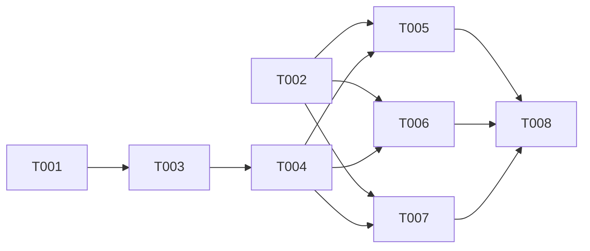

# Plan: AST Parser Multi-Language Support

## Overview
- **Source**: Feature description (AST 파서 추가 언어 지원)
- **Issue**: #5
- **Created**: 2026-02-04
- **Approach**: Balanced - 기존 패턴 유지 + 언어별 파일 분리

## Problem 1-Pager

### Context
RPG의 `ASTParser`는 현재 TypeScript, JavaScript, Python만 지원한다.
`detectLanguage()`에는 Rust, Go, Java, Kotlin, Dart 매핑이 존재하지만 실제 파서는 미구현이다.
vendor 코드(`context-please`)에 참고할 수 있는 다국어 지원 구현이 있다.

### Problem
지원 언어가 3개로 제한되어 다양한 리포지토리의 RPG 인코딩이 불완전하다.
`detectLanguage()`가 언어를 감지하더라도 "Unsupported language" 에러를 반환한다.

### Goal
- tree-sitter 공식 패키지가 있는 Rust, Go, Java 3개 언어 지원 추가
- 300 LOC 제한 준수를 위한 파일 분리 리팩토링
- 향후 언어 추가가 쉬운 구조 확립

### Non-Goals
- GraphQL 지원 (안정적인 tree-sitter 파서 없음, 별도 이슈로 추적)
- Kotlin, Dart 지원 (커뮤니티 패키지 안정성 부족, 후속 이슈로)
- AST 분석 깊이 변경 (entity/import 추출 수준 유지)
- TypeScript interface/type alias를 entity로 추출 (현재 미지원, 후속 이슈)
- Python decorated_definition 별도 처리 (function_definition으로 처리됨)

### Constraints
- tree-sitter ^0.21.1 호환 필수 (현재 프로젝트 버전)
- 기존 TypeScript/JavaScript/Python 동작 변경 없음 (regression 방지)
- Bun 런타임 호환 (CommonJS require 패턴)

## Architecture Decision

현재 `ast.ts` (511 LOC)에 모든 언어 로직이 포함되어 있다.
3개 언어를 추가하면 ~800+ LOC로 300 LOC 제한을 초과한다.

**결정**: `src/utils/ast/` 디렉토리로 리팩토링하여 언어별 모듈 분리

```
src/utils/ast.ts (현재, 511 LOC)
  ↓ 리팩토링
src/utils/ast/
  ├── index.ts          # ASTParser 클래스 (re-export)
  ├── types.ts          # CodeEntity, ParseResult, LanguageConfig 타입
  ├── parser.ts         # ASTParser 클래스 (핵심 로직)
  ├── languages/
  │   ├── index.ts      # LANGUAGE_CONFIGS 통합 export
  │   ├── typescript.ts  # TS/JS config + import extraction
  │   ├── python.ts      # Python config + import extraction
  │   ├── rust.ts        # Rust config + import extraction
  │   ├── go.ts          # Go config + import extraction
  │   └── java.ts        # Java config + import extraction
```

**대안 비교**:
- ~~최소 변경~~: ast.ts가 800+ LOC로 비대해짐, 300 LOC 제한 위반
- ~~플러그인 아키텍처~~: 과도한 추상화, 현 시점 YAGNI 위반

## Tasks

### Parallel Group 1: 기반 리팩토링
- [ ] T001 [P] 타입 분리 - types.ts 생성 (file: src/utils/ast/types.ts)
  - `CodeEntity`, `ParseResult`, `LanguageConfig`, `SupportedLanguage` 이동
  - 기존 `src/utils/ast.ts`에서 타입 정의 추출
  - `SupportedLanguage`에 `'rust' | 'go' | 'java'` 미리 추가 (T005-T007 병렬 실행 위해)
- [ ] T002 [P] tree-sitter 패키지 설치 (depends: none)
  - `bun add tree-sitter-rust tree-sitter-go tree-sitter-java`
  - peer dependency `tree-sitter: ^0.21.1` 호환성 검증

### Sequential Group 1: 언어 모듈 분리
- [ ] T003 기존 언어 모듈 분리 (depends on T001)
  - `languages/typescript.ts`: TS/JS config, entity types, JS import extraction
  - `languages/python.ts`: Python config, entity types, Python import extraction
  - `languages/index.ts`: 통합 LANGUAGE_CONFIGS export
  - `bun run test tests/ast.test.ts` 전체 통과 확인 (regression check)
- [ ] T004 ASTParser 클래스 리팩토링 (depends on T003)
  - `parser.ts`: ASTParser 클래스를 languages/ config 사용하도록 변경
  - `index.ts`: re-export (ASTParser, types)
  - 기존 `src/utils/ast.ts` 제거, `src/utils/index.ts` import 경로 업데이트
  - 기존 테스트 전체 통과 확인

### Parallel Group 2: 신규 언어 추가
- [ ] T005 [P] Rust 언어 지원 추가 (depends on T004)
  - `languages/rust.ts`: entity types (`function_item`, `struct_item`, `impl_item`, `trait_item`, `enum_item`, `mod_item`), import types (`use_declaration`), Rust import extraction
  - CommonJS require 패턴 사용: `const Rust = require('tree-sitter-rust')`
  - 테스트: function_item, struct_item, impl_item, trait_item 파싱
  - 테스트: use_declaration import extraction (`use std::collections::HashMap;`, `use crate::module::*;`)
- [ ] T006 [P] Go 언어 지원 추가 (depends on T004)
  - `languages/go.ts`: entity types (`function_declaration`, `method_declaration`, `type_declaration`), import types (`import_declaration`), Go import extraction
  - CommonJS require 패턴 사용: `const Go = require('tree-sitter-go')`
  - 테스트: function_declaration, method_declaration, type_declaration 파싱
  - 테스트: import extraction - single (`import "fmt"`), grouped (`import ( "fmt"; "os" )`)
- [ ] T007 [P] Java 언어 지원 추가 (depends on T004)
  - `languages/java.ts`: entity types (`method_declaration`, `class_declaration`, `interface_declaration`, `constructor_declaration`), import types (`import_declaration`), Java import extraction
  - CommonJS require 패턴 사용: `const Java = require('tree-sitter-java')`
  - 테스트: method_declaration, class_declaration, interface_declaration 파싱
  - 테스트: import extraction (`import java.util.List;`, `import static org.junit.Assert.*;`)

### Sequential Group 2: 통합 검증
- [ ] T008 통합 테스트 및 문서 업데이트 (depends on T005, T006, T007)
  - `languages/index.ts`에 신규 언어 config 등록
  - encoder 통합 테스트: 다국어 리포지토리 인코딩 테스트
  - `bun run test` 전체 통과 확인
  - CLAUDE.md 업데이트: 지원 언어 목록

## Dependencies



## Key Files

### 생성
- `src/utils/ast/types.ts` - 타입 정의
- `src/utils/ast/parser.ts` - ASTParser 클래스
- `src/utils/ast/index.ts` - Re-export
- `src/utils/ast/languages/index.ts` - 언어 config 통합
- `src/utils/ast/languages/typescript.ts` - TS/JS 언어 config
- `src/utils/ast/languages/python.ts` - Python 언어 config
- `src/utils/ast/languages/rust.ts` - Rust 언어 config
- `src/utils/ast/languages/go.ts` - Go 언어 config
- `src/utils/ast/languages/java.ts` - Java 언어 config

### 수정
- `src/utils/index.ts` - import 경로 변경
- `package.json` - tree-sitter-rust, tree-sitter-go, tree-sitter-java 추가

### 삭제
- `src/utils/ast.ts` - 디렉토리 구조로 대체

## Verification

### Automated Tests
- [ ] 기존 TypeScript/JavaScript/Python 테스트 전체 통과 (tests/ast.test.ts regression)
- [ ] Rust: function_item, struct_item, impl_item, use_declaration 파싱
- [ ] Go: function_declaration, method_declaration, import_declaration 파싱
- [ ] Java: method_declaration, class_declaration, import_declaration 파싱
- [ ] 각 언어별 import extraction 테스트 (Rust use, Go import, Java import)
- [ ] 지원되지 않는 언어 에러 처리 유지
- [ ] 빈 소스 코드 처리 유지

### Manual Testing
- [ ] `bun run src/cli.ts encode` 로 다국어 리포지토리 인코딩 테스트
- [ ] 각 언어별 샘플 파일 파싱 결과 확인

### Acceptance Criteria Check
- [ ] Rust, Go, Java 소스 코드에서 entity (함수, 클래스, 메서드) 추출
- [ ] Rust, Go, Java 소스 코드에서 import 관계 추출
- [ ] 기존 3개 언어 (TS/JS/Python) 동작 변경 없음
- [ ] ast.ts 300 LOC 제한 준수 (파일 분리)
- [ ] `bun run test` 전체 통과

## Notes

### 참고 구현
- `vendor/context-please/packages/core/src/splitter/ast-splitter.ts`에 Go, Java, Rust 등의 node type 매핑 참고

### 후속 이슈
- GraphQL 지원: 안정적인 tree-sitter 파서가 나오면 별도 이슈로 추적
- Kotlin 지원: `@tree-sitter-grammars/tree-sitter-kotlin` 안정화 후 추가
- Dart 지원: npm 패키지 업데이트 후 추가

### tree-sitter 호환성
- 모든 신규 파서는 `tree-sitter: ^0.21.1` peer dependency 확인 필요
- CommonJS require 패턴 사용 (Bun 호환)

## Review Status
- **Reviewed**: 2026-02-04
- **Result**: APPROVED (minor revisions applied)
- **User Approved**: Yes
- **Issue**: #5
