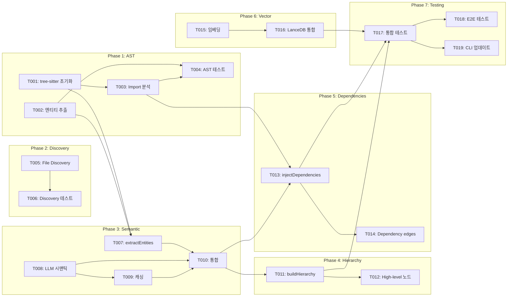

# Plan: Encoder 구현 완성

## Overview
- **Source**: Feature description (docs/plan.md 항목 2)
- **Issue**: #3 (https://github.com/pleaseai/rpg/issues/3)
- **Created**: 2026-02-04
- **Approach**: Full Feature (AST + LLM + Vector Search)

## Review Status
- **Reviewed**: 2026-02-04
- **Result**: APPROVED
- **User Approved**: Yes
- **Issue**: #3

## Architecture Decision

연구 논문 (RPG-Encoder: https://arxiv.org/abs/2602.02084)의 3단계 파이프라인을 완전히 구현합니다:

1. **Semantic Lifting**: AST로 코드 구조 추출 → LLM으로 시맨틱 설명 생성
2. **Structural Reorganization**: LLM으로 기능적 계층 구조 구축
3. **Artifact Grounding**: AST 분석으로 의존성 엣지 추가

### 설계 원칙
- **모듈화**: 각 단계를 독립 모듈로 분리하여 테스트 용이성 확보
- **선택적 LLM**: API 키 없으면 기본 시맨틱 폴백 제공
- **벡터 검색**: LanceDB로 시맨틱 유사도 검색 지원
- **캐싱**: LLM 응답 캐싱으로 비용 절감

## Tasks

### Phase 1: AST Parser 구현
- [ ] T001 [P] tree-sitter 초기화 및 TypeScript/Python 파서 구현 (file: src/utils/ast.ts)
- [ ] T002 [P] 엔티티 추출 로직 구현 (함수, 클래스, 메서드) (file: src/utils/ast.ts)
- [ ] T003 Import/Export 분석 로직 구현 (depends on T001, file: src/utils/ast.ts)
- [ ] T004 AST 파서 유닛 테스트 작성 (depends on T002, T003, file: tests/ast.test.ts)

### Phase 2: File Discovery
- [ ] T005 [P] discoverFiles() 구현 - glob 패턴 매칭 (file: src/encoder/encoder.ts)
- [ ] T006 File discovery 유닛 테스트 (depends on T005, file: tests/encoder.test.ts)

### Phase 3: Semantic Extraction
- [ ] T007 [P] extractEntities() 구현 - AST 파싱 (file: src/encoder/encoder.ts)
- [ ] T008 LLM 시맨틱 설명 생성 모듈 (file: src/encoder/semantic.ts)
- [ ] T009 시맨틱 캐싱 레이어 (depends on T008, file: src/encoder/cache.ts)
- [ ] T010 Semantic extraction 통합 (depends on T007, T008, T009, file: src/encoder/encoder.ts)

### Phase 4: Functional Hierarchy
- [ ] T011 buildFunctionalHierarchy() 구현 - LLM 기반 그룹화 (depends on T010, file: src/encoder/encoder.ts)
- [ ] T012 High-level 노드 생성 로직 (depends on T011, file: src/encoder/hierarchy.ts)

### Phase 5: Dependency Injection
- [ ] T013 injectDependencies() 구현 - import/call 분석 (depends on T003, T010, file: src/encoder/encoder.ts)
- [ ] T014 Dependency edge 생성 로직 (depends on T013, file: src/encoder/dependencies.ts)

### Phase 6: Vector Search Integration
- [ ] T015 [P] 벡터 임베딩 생성 모듈 (file: src/encoder/embedding.ts)
- [ ] T016 LanceDB 통합 - 시맨틱 검색 지원 (depends on T015, file: src/encoder/encoder.ts)

### Phase 7: Integration & Testing
- [ ] T017 Encoder 통합 테스트 (depends on T011, T013, T016, file: tests/encoder.integration.test.ts)
- [ ] T018 실제 레포지토리 인코딩 E2E 테스트 (depends on T017, file: tests/encoder.e2e.test.ts)
- [ ] T019 CLI encode 명령 업데이트 (depends on T017, file: src/cli.ts)

## Dependencies



**Parallel Group 1**: T001, T002, T005, T015 (독립적으로 병렬 실행 가능)
**Sequential Dependencies**:
- T001 → T003 → T004
- T007, T008, T009 → T010 → T011 → T012
- T010, T003 → T013 → T014
- T015 → T016
- T011, T013, T016 → T017 → T018, T019

## Key Files

### 수정할 파일
| 파일 | 목적 | 변경 내용 |
|------|------|----------|
| `src/utils/ast.ts` | AST 파서 | tree-sitter 구현, 엔티티/import 추출 |
| `src/encoder/encoder.ts` | 메인 인코더 | 4개 TODO 메서드 구현 |
| `src/cli.ts` | CLI | encode 명령 옵션 업데이트 |
| `tests/encoder.test.ts` | 테스트 | 실제 동작 검증 테스트 추가 |

### 생성할 파일
| 파일 | 목적 |
|------|------|
| `src/encoder/semantic.ts` | LLM 시맨틱 설명 생성 |
| `src/encoder/cache.ts` | 시맨틱 캐싱 레이어 |
| `src/encoder/hierarchy.ts` | 기능적 계층 구조 생성 |
| `src/encoder/dependencies.ts` | 의존성 분석 및 엣지 생성 |
| `src/encoder/embedding.ts` | 벡터 임베딩 생성 |
| `tests/ast.test.ts` | AST 파서 유닛 테스트 |
| `tests/encoder.integration.test.ts` | 통합 테스트 |
| `tests/encoder.e2e.test.ts` | E2E 테스트 |

## Technical Details

### tree-sitter 사용 (참고: vendor/context-please/packages/core/src/splitter/ast-splitter.ts)

```typescript
// TypeScript 파서 초기화 - 검증된 패턴 사용
import Parser from 'tree-sitter'
const TypeScript = require('tree-sitter-typescript').typescript
const Python = require('tree-sitter-python')

const parser = new Parser()
parser.setLanguage(TypeScript)
```

### 언어별 분할 가능한 노드 타입 (ast-splitter.ts에서 검증됨)
```typescript
const SPLITTABLE_NODE_TYPES = {
  typescript: [
    'function_declaration', 'arrow_function', 'class_declaration',
    'method_definition', 'export_statement', 'interface_declaration',
    'type_alias_declaration'
  ],
  python: [
    'function_definition', 'class_definition', 'decorated_definition',
    'async_function_definition'
  ],
  // 추가 언어 지원 가능
}
```

### AST 노드 순회 패턴
```typescript
const traverse = (node: Parser.SyntaxNode) => {
  if (splittableTypes.includes(node.type)) {
    // 엔티티 추출
    const startLine = node.startPosition.row + 1
    const endLine = node.endPosition.row + 1
    const nodeText = code.slice(node.startIndex, node.endIndex)
  }

  for (const child of node.children) {
    traverse(child)
  }
}
```

### 시맨틱 추출 프롬프트
```
Given this code entity, generate a semantic description:
- Use verb + object format (e.g., "handle authentication")
- Focus on purpose, not implementation
- Include relevant keywords for search
```

### 계층 구조 생성 프롬프트
```
Given these code entities, group them into logical modules:
- Create high-level nodes for architectural directories
- Assign functional parent-child relationships
- Consider cohesion and coupling
```

## Verification

### Automated Tests
- [ ] AST 파서 유닛 테스트 통과 (tests/ast.test.ts)
- [ ] Encoder 유닛 테스트 통과 (tests/encoder.test.ts)
- [ ] 통합 테스트 통과 (tests/encoder.integration.test.ts)
- [ ] E2E 테스트 통과 (tests/encoder.e2e.test.ts)
- [ ] TypeScript 타입 체크 통과 (`bun run typecheck`)
- [ ] Lint 통과 (`bun run lint`)

### Manual Testing
- [ ] 현재 rpg 프로젝트 자체를 인코딩하여 RPG 생성 확인
- [ ] 생성된 RPG JSON 파일이 유효한 구조인지 확인
- [ ] MCP 서버에서 인코딩된 RPG 사용 테스트

### Acceptance Criteria Check
- [ ] discoverFiles(): 레포지토리 파일 순회 동작
- [ ] AST 파싱: tree-sitter로 코드 구조 분석 동작
- [ ] 시맨틱 추출: LLM으로 기능 설명 생성 동작
- [ ] 의존성 주입: import/call 관계 추출 동작
- [ ] 벡터 검색: 시맨틱 유사도 검색 동작

## Notes

### 기존 완성된 유틸리티 활용
- `src/utils/llm.ts`: LLMClient 완전 구현됨 (Anthropic/OpenAI)
- `src/utils/vector.ts`: VectorStore 완전 구현됨 (LanceDB)
- `src/graph/*`: 그래프 자료구조 완전 구현됨

### LLM 비용 고려
- 시맨틱 추출은 각 엔티티마다 LLM 호출 필요
- 캐싱 레이어로 중복 호출 방지
- 대규모 레포의 경우 배치 처리 고려

### 점진적 업데이트 (evolve)
- 현재 TODO 상태인 `evolve()` 메서드는 이번 범위에 포함하지 않음
- Git commit 기반 증분 업데이트는 후속 작업으로 분리

### 참고 자료
- RPG-Encoder 논문: https://arxiv.org/abs/2602.02084
- tree-sitter 문서: https://tree-sitter.github.io/tree-sitter/
- 프로젝트 CLAUDE.md: 아키텍처 및 코딩 컨벤션 참조
- **AST 분할 구현 참고**: `vendor/context-please/packages/core/src/splitter/ast-splitter.ts`
  - tree-sitter 초기화 패턴
  - 언어별 노드 타입 매핑
  - AST 순회 및 엔티티 추출 로직
  - 폴백 처리 패턴
