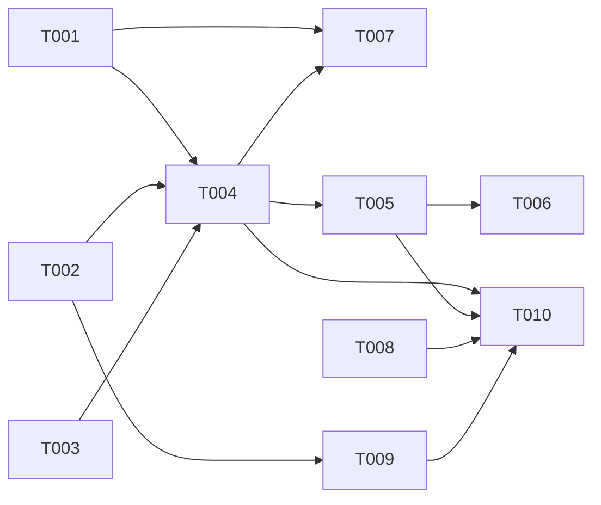

# Plan: MCP Server Implementation

## Overview
- **Source**: Feature description (natural language)
- **Issue**: Not created (user choice)
- **Created**: 2026-02-04
- **Approach**: Pragmatic - Modular MCP Tools

## Review Status
- **Reviewed**: 2026-02-04
- **Result**: APPROVED (after revision)
- **User Approved**: Yes
- **Notes**: rpg_encode included, RPG lifecycle via CLI arg, error handling added

## Context

The RPG (Repository Planning Graph) project already has fully implemented components:
- `SearchNode`: Global node-level retrieval for semantic search (`src/tools/search.ts`)
- `FetchNode`: Precise metadata and source context retrieval (`src/tools/fetch.ts`)
- `ExploreRPG`: Cross-view graph traversal (`src/tools/explore.ts`)
- `RPGEncoder`: Repository to RPG conversion (`src/encoder/encoder.ts`)
- `RepositoryPlanningGraph.getStats()`: Graph statistics (`src/graph/rpg.ts`)

These tools need to be exposed via MCP (Model Context Protocol) server for Claude Code integration.

## Architecture Decision

**Chosen Approach**: Pragmatic - Modular MCP Tools

**Reasoning**:
1. Matches existing code style (simple, direct classes)
2. Tools are already well-defined in `src/tools/`
3. Provides structure without over-engineering
4. Easy to extend with new tools

**File Structure**:
```
src/
  mcp/
    server.ts       # MCP server setup with stdio transport
    tools.ts        # All MCP tool definitions
    errors.ts       # MCP error types and helpers
    index.ts        # Module exports
```

### RPG Lifecycle Management

**Approach**: Server initialization with RPG path (CLI argument)

**Rationale**:
- Simpler implementation (no runtime state mutation)
- Follows standard MCP server pattern
- Clearer error handling (fail fast on startup)

**Implementation**:
- RPG file path passed as CLI argument: `bun run src/mcp/server.ts <rpg-file.json>`
- Server loads RPG once during initialization
- All tools share single RPG instance
- Runtime RPG loading deferred to Phase 2 (multi-RPG support)

## Technical Details

### MCP SDK Integration
- Package: `@modelcontextprotocol/sdk`
- Server class: `McpServer` from `@modelcontextprotocol/sdk/server/mcp.js`
- Transport: `StdioServerTransport` from `@modelcontextprotocol/sdk/server/stdio.js`
- Schema validation: `zod` (already in project)

### Tools to Expose

| MCP Tool | Existing Implementation | Purpose |
|----------|------------------------|---------|
| `rpg_search` | `SearchNode.query()` | Semantic code search |
| `rpg_fetch` | `FetchNode.get()` | Entity detail retrieval |
| `rpg_explore` | `ExploreRPG.traverse()` | Graph traversal |
| `rpg_encode` | `RPGEncoder.encode()` | Repository → RPG conversion |
| `rpg_stats` | `RPG.getStats()` | Graph statistics |

**Note**: RPG file path is provided at server startup via CLI argument.

### Input/Output Schemas

#### rpg_search
```typescript
inputSchema: {
  mode: z.enum(['features', 'snippets', 'auto']).default('auto'),
  featureTerms: z.array(z.string()).optional(),
  filePattern: z.string().optional()
}
outputSchema: {
  nodes: z.array(NodeSchema),
  totalMatches: z.number(),
  mode: z.string()
}
```

#### rpg_fetch
```typescript
inputSchema: {
  codeEntities: z.array(z.string()).optional(),
  featureEntities: z.array(z.string()).optional()
}
outputSchema: {
  entities: z.array(EntityDetailSchema),
  notFound: z.array(z.string())
}
```

#### rpg_explore
```typescript
inputSchema: {
  startNode: z.string(),
  edgeType: z.enum(['functional', 'dependency', 'both']).default('both'),
  maxDepth: z.number().default(3),
  direction: z.enum(['out', 'in', 'both']).default('out')
}
outputSchema: {
  nodes: z.array(NodeSchema),
  edges: z.array(EdgeSchema),
  maxDepthReached: z.number()
}
```

#### rpg_encode
```typescript
inputSchema: {
  repoPath: z.string().describe('Repository path to encode'),
  includeSource: z.boolean().default(false),
  outputPath: z.string().optional()
}
outputSchema: {
  success: z.boolean(),
  filesProcessed: z.number(),
  entitiesExtracted: z.number(),
  duration: z.number(),
  rpgPath: z.string().optional()
}
```

#### rpg_stats
```typescript
inputSchema: {} // No input required, uses loaded RPG
outputSchema: {
  name: z.string(),
  nodeCount: z.number(),
  edgeCount: z.number(),
  highLevelNodeCount: z.number(),
  lowLevelNodeCount: z.number(),
  functionalEdgeCount: z.number(),
  dependencyEdgeCount: z.number()
}
```

### Error Handling

MCP errors will use standard MCP error response format:

```typescript
// src/mcp/errors.ts
export enum RPGErrorCode {
  RPG_NOT_LOADED = 'RPG_NOT_LOADED',
  NODE_NOT_FOUND = 'NODE_NOT_FOUND',
  INVALID_PATH = 'INVALID_PATH',
  ENCODE_FAILED = 'ENCODE_FAILED',
}

export class RPGError extends Error {
  constructor(
    public code: RPGErrorCode,
    message: string
  ) {
    super(message)
  }
}
```

## Tasks

- [ ] T001 [P] Install MCP SDK dependency (file: package.json)
- [ ] T002 [P] Create MCP tool definitions with zod schemas (file: src/mcp/tools.ts)
- [ ] T003 [P] Define MCP error response types (file: src/mcp/errors.ts)
- [ ] T004 Create MCP server with tool registration (depends on T001, T002, T003, file: src/mcp/server.ts)
- [ ] T005 Create MCP module exports (depends on T004, file: src/mcp/index.ts)
- [ ] T006 Add MCP entry point to exports (depends on T005, file: src/index.ts)
- [ ] T007 Add MCP server bin script (depends on T001, T004, file: package.json)
- [ ] T008 Create sample RPG fixture (file: tests/fixtures/sample-rpg.json)
- [ ] T009 Write unit tests for MCP tools (depends on T002, file: tests/mcp.test.ts)
- [ ] T010 Write integration test with sample RPG (depends on T004, T005, T008, T009, file: tests/mcp-integration.test.ts)
- [ ] T011 Update CLAUDE.md with MCP usage instructions (depends on T004)

## Dependencies



**Parallel Group 1**: T001, T002, T003, T008 (independent)
**Sequential**: T002 → T009
**Sequential**: T001, T002, T003 → T004 → T005 → T006
**Sequential**: T001, T004 → T007
**Sequential**: T004, T005, T008, T009 → T010

## Key Files

### New Files
- `src/mcp/server.ts` - MCP server with stdio transport
- `src/mcp/tools.ts` - Tool definitions with zod schemas
- `src/mcp/errors.ts` - MCP error types and helper functions
- `src/mcp/index.ts` - Module exports
- `tests/fixtures/sample-rpg.json` - Sample RPG for testing
- `tests/mcp.test.ts` - Unit tests
- `tests/mcp-integration.test.ts` - Integration tests

### Modified Files
- `package.json` - Add @modelcontextprotocol/sdk dependency, add bin script
- `src/index.ts` - Export MCP module
- `CLAUDE.md` - Add MCP usage instructions

## Verification

### Automated Tests
- [ ] Unit tests pass for all MCP tool definitions
- [ ] Integration tests verify tool execution with sample RPG
- [ ] TypeScript type checking passes

### Manual Testing
- [ ] MCP server starts via `bun run src/mcp/server.ts sample.json`
- [ ] Tools respond correctly via MCP client
- [ ] Claude Code can connect and use tools

### Acceptance Criteria Check
- [ ] All 5 tools (search, fetch, explore, encode, stats) are exposed via MCP
- [ ] Server uses stdio transport for Claude Code compatibility
- [ ] Error handling returns appropriate MCP error responses
- [ ] Tool schemas match existing tool interfaces

## Notes

- The MCP server loads RPG from file path passed as CLI argument
- Multiple RPG files are not supported in this version (single RPG per session)
- HTTP transport can be added later as an optional feature
- For `rpg_encode`, the tool can work without a pre-loaded RPG

## Implementation Sequence

1. **Setup**: Install dependency, create directory structure
2. **Core**: Define tool schemas, error types, implement server
3. **Integration**: Wire up exports, add bin script
4. **Testing**: Create fixtures, unit tests, integration tests
5. **Documentation**: Update CLAUDE.md

## Claude Code Configuration

After implementation, users can configure Claude Code to use the MCP server:

```json
{
  "mcpServers": {
    "rpg": {
      "command": "bun",
      "args": ["run", "/path/to/rpg/src/mcp/server.ts", "/path/to/rpg-file.json"],
      "env": {}
    }
  }
}
```

Or with built package:

```json
{
  "mcpServers": {
    "rpg": {
      "command": "rpg-mcp",
      "args": ["/path/to/rpg-file.json"]
    }
  }
}
```
