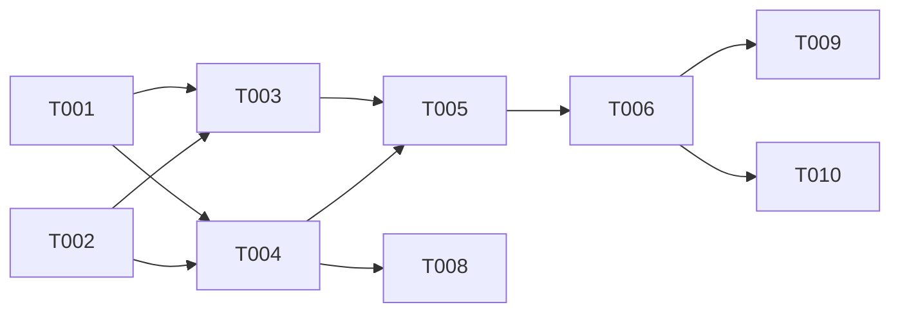

# Plan: Domain Discovery and 3-Level Path Semantic Reorganization

## Overview

- **Source**: Issue #12
- **Issue**: #12
- **Created**: 2026-02-06
- **Approach**: Paper-Faithful — Implement §3.2 (arXiv:2602.02084) semantic reorganization with LLM-only domain discovery

## Architecture Decision

Replace the current directory-mirroring hierarchy in `buildFunctionalHierarchy()` with LLM-based semantic reorganization implementing the paper's two-step approach: (1) Domain Discovery to identify functional areas, and (2) Hierarchical Construction to build `<functional_area>/<category>/<subcategory>` paths.

**Rationale**:
- The paper explicitly describes directory mirroring as "structural entanglement" — the core problem this feature solves
- Domain Discovery is a batch-level LLM operation on compressed file-level features (fits in context window)
- Hierarchical Construction is a constrained assignment: map file groups to 3-level paths using discovered domains
- Both operations produce HighLevelNodes with FunctionalEdges — compatible with existing graph infrastructure
- The existing `SemanticRouter` in `src/encoder/evolution/semantic-router.ts` already implements FindBestParent — evolution's InsertNode can route into the new hierarchy without changes

**Key Design Decisions**:
1. **LLM-only (no heuristic fallback)**: Domain Discovery is inherently semantic — a heuristic fallback would produce the same directory-mirroring hierarchy we're replacing. If no LLM provider is configured, throw an explicit error.
2. **New module `src/encoder/reorganization/`**: Keep semantic reorganization separate from the encoder orchestrator (encoder.ts already 746 LOC). Clear boundary: Phase 1 stays in encoder.ts, Phase 2 delegates to reorganization module, Phase 3 stays in encoder.ts.
3. **Input compression**: Only pass file-level semantic features (not function/class-level) to the LLM for Domain Discovery — this is the paper's "granularity-based input compression" that allows the complete repository to fit in context. File-level aggregation from function/class features is already implemented in `SemanticExtractor.aggregateFileFeatures()` (commit #29).
4. **HighLevelNode ID scheme**: Use semantic path as ID — `domain:DataProcessing`, `domain:DataProcessing/pipeline orchestration`, `domain:DataProcessing/pipeline orchestration/task scheduling` — making the 3-level hierarchy explicit in IDs.
5. **Backward compatibility for `directoryPath`**: New HighLevelNodes will NOT have `directoryPath` set (they are semantic, not physical). Phase 3 (Artifact Grounding, issue #13) will later populate metadata via LCA-based path propagation. For now, the `metadata.path` field will be left empty on HighLevelNodes.
6. **Shared LLMClient instance**: Create a single `LLMClient` in `RPGEncoder` constructor and pass it to both `SemanticExtractor` and reorganization modules. This ensures consistent configuration and enables future request batching.
7. **Prompt parsing via `<solution>` tags**: Both prompts use the paper's `<solution>...</solution>` wrapper format. Use `llmClient.complete()` + custom `parseSolutionTag()` extraction for both Domain Discovery and Hierarchical Construction (not `completeJSON()`).
8. **3-level path validation**: Strictly validate that all LLM-returned paths have exactly 3 levels. Reject and retry with correction instructions if validation fails.

## Module Structure

```
src/encoder/reorganization/
├── index.ts              # Public exports
├── types.ts              # DomainDiscoveryResult, HierarchicalMapping types
├── domain-discovery.ts   # LLM-based functional area identification
├── hierarchy-builder.ts  # 3-level path construction + node/edge creation
└── prompts.ts            # LLM prompt templates (from paper Appendix)
```

## Tasks

- [ ] T001 [P] Define reorganization types and interfaces (file: src/encoder/reorganization/types.ts)
- [ ] T002 [P] Implement LLM prompts for domain discovery and hierarchical construction (file: src/encoder/reorganization/prompts.ts)
- [ ] T003 Implement Domain Discovery — identify functional areas from file-level features (depends on T001, T002, file: src/encoder/reorganization/domain-discovery.ts)
- [ ] T004 Implement Hierarchy Builder — construct 3-level paths and create HighLevelNodes with FunctionalEdges (depends on T001, T002, file: src/encoder/reorganization/hierarchy-builder.ts)
- [ ] T005 Create module index with public exports (depends on T003, T004, file: src/encoder/reorganization/index.ts)
- [ ] T006 Rewrite `buildFunctionalHierarchy()` in encoder.ts to delegate to new reorganization module (depends on T005, file: src/encoder/encoder.ts)
- [ ] T007 Write unit tests for Domain Discovery with mock LLM (file: tests/reorganization/domain-discovery.test.ts)
- [ ] T008 Write unit tests for Hierarchy Builder with mock LLM (depends on T004, file: tests/reorganization/hierarchy-builder.test.ts)
- [ ] T009 Write integration test — full encode with semantic reorganization (depends on T006, file: tests/reorganization/reorganization.integration.test.ts)
- [ ] T010 Update implementation-status.md (depends on T006, file: docs/implementation-status.md)

## Dependencies



**Parallel Group 1**: T001, T002 (independent — types and prompts)
**Parallel Group 2**: T003, T004 (depend on T001+T002, independent of each other)
**Sequential**: T005 → T006
**Parallel Group 3**: T007, T008 (test development)
**Post-integration**: T009, T010

## Key Files

### Files to Create

| File | Purpose |
|------|---------|
| `src/encoder/reorganization/types.ts` | Type definitions: DomainDiscoveryResult, HierarchicalMapping, FileFeatureGroup |
| `src/encoder/reorganization/prompts.ts` | LLM prompt templates from paper (domain discovery + hierarchical construction) |
| `src/encoder/reorganization/domain-discovery.ts` | DomainDiscovery class: analyze file features → functional areas |
| `src/encoder/reorganization/hierarchy-builder.ts` | HierarchyBuilder class: assign features to 3-level paths, create HighLevelNodes |
| `src/encoder/reorganization/index.ts` | Module barrel exports |
| `tests/reorganization/domain-discovery.test.ts` | Unit tests for domain discovery |
| `tests/reorganization/hierarchy-builder.test.ts` | Unit tests for hierarchy builder |
| `tests/reorganization/reorganization.integration.test.ts` | Integration test with full encode |

### Files to Modify

| File | Change |
|------|--------|
| `src/encoder/encoder.ts` | Rewrite `buildFunctionalHierarchy()` to delegate to reorganization module; remove `groupNodesByDirectory()`, `createDirectoryNodes()`, `createDirectoryHierarchyEdges()`, `createDirectoryToFileEdges()` |
| `docs/implementation-status.md` | Move Domain Discovery + 3-Level Path from §2.2 to §1 |

### Existing Files to Reuse (read-only)

| File | What We Reuse |
|------|---------------|
| `src/utils/llm.ts` | LLMClient for domain discovery and hierarchical construction LLM calls |
| `src/graph/rpg.ts` | `addHighLevelNode()`, `addFunctionalEdge()`, `getLowLevelNodes()` |
| `src/graph/node.ts` | `HighLevelNode`, `SemanticFeature` types |
| `src/encoder/semantic.ts` | `SemanticExtractor` for feature extraction (already used in Phase 1) |

## Task Details

### T001: Reorganization Types

```typescript
// File-level feature group — input to Domain Discovery and Hierarchical Construction.
// Grouped by top-level directory for initial presentation to LLM.
// The LLM then reorganizes these groups semantically, decoupling from the directory structure.
interface FileFeatureGroup {
  /** Top-level directory label used as grouping key for LLM input (e.g., "encoder", "graph") */
  groupLabel: string
  /** File-level semantic features within this group */
  fileFeatures: Array<{
    fileId: string          // LowLevelNode ID for the file
    filePath: string        // Relative path (retained for file→node resolution)
    description: string     // File-level SemanticFeature.description (from Phase 1 aggregation)
    keywords: string[]
  }>
}

// Domain Discovery output
interface DomainDiscoveryResult {
  /** Identified functional areas (PascalCase, e.g., "DataProcessing") */
  functionalAreas: string[]
}

// Hierarchical Construction output
interface HierarchicalMapping {
  /**
   * Maps 3-level path → array of group labels (from FileFeatureGroup.groupLabel)
   * e.g., "DataProcessing/pipeline orchestration/task scheduling": ["data_loader", "dataset"]
   */
  assignments: Record<string, string[]>
}

// Options for reorganization
interface ReorganizationOptions {
  /** LLM client (required — no heuristic fallback) */
  llmClient: LLMClient
}
```

### T002: LLM Prompts

Two prompt templates faithfully translated from the paper's Appendix:

**1. Domain Discovery Prompt** (from `prompts/domain_discovery.tex`):
- System: Expert software architect and repository analyst
- Input: List of file-level features grouped by top-level directory
- Guidelines: Think from architecture perspective, avoid individual files, use PascalCase
- Output: JSON array of functional area names in `<solution>` tags
- Parse: Extract JSON from `<solution>...</solution>` wrapper

**2. Hierarchical Construction Prompt** (from `prompts/hierarchical_construction.tex`):
- System: Expert repository refactoring specialist
- Input: Discovered functional areas + parsed feature groups (directory → features)
- Target path format: `<functional_area>/<category>/<subcategory>` — exactly 3 levels
- Semantic naming rules: verb+object, lowercase, single responsibility
- Scope: Only assign top-level groups, exclude docs/tests/vendor
- Output: JSON object mapping 3-level paths → arrays of top-level group names

**Implementation notes**:
- Both prompts use the paper's `<solution>...</solution>` wrapper format
- Use `llmClient.complete()` + shared `parseSolutionTag()` extraction for both
- Do NOT use `completeJSON()` — the paper's prompts are not standard JSON responses
- Include a shared `parseSolutionTag(response: string): string` utility that extracts content from `<solution>` tags and parses as JSON
- Both prompts include the paper's exact naming rules and constraints

### T003: Domain Discovery

```typescript
class DomainDiscovery {
  constructor(private llmClient: LLMClient)

  /**
   * Discover functional areas from file-level features.
   *
   * Implements paper §3.2 Step 1: "Functional Abstraction"
   * - Compresses to file-level features only (granularity-based input compression)
   * - LLM analyzes the complete repository-wide semantic manifold
   * - Returns abstract functional centroids (PascalCase names)
   */
  async discover(fileGroups: FileFeatureGroup[]): Promise<DomainDiscoveryResult>
}
```

**Algorithm**:
1. Format file groups as a condensed view: for each group label, list file descriptions
2. Build the Domain Discovery prompt with the formatted input
3. Call LLM via `complete()` + `parseSolutionTag()`
4. Parse JSON array of functional area names
5. Validate: ensure all returned areas are non-empty PascalCase strings
6. Deduplicate and return

**Error handling**:
- If LLM returns malformed output, retry once with format correction
- If LLM is not configured, throw `Error('Domain Discovery requires an LLM provider. Set GOOGLE_API_KEY, ANTHROPIC_API_KEY, or OPENAI_API_KEY.')`

### T004: Hierarchy Builder

```typescript
class HierarchyBuilder {
  constructor(
    private rpg: RepositoryPlanningGraph,
    private llmClient: LLMClient,
  )

  /**
   * Build 3-level semantic hierarchy from functional areas and file features.
   *
   * Implements paper §3.2 Step 2: "Hierarchical Aggregation"
   * - Assigns file groups to 3-level paths
   * - Creates HighLevelNodes for each path segment
   * - Creates FunctionalEdges for the hierarchy
   * - Links file LowLevelNodes to their leaf HighLevelNodes
   */
  async build(
    functionalAreas: string[],
    fileGroups: FileFeatureGroup[],
  ): Promise<void>
}
```

**Algorithm**:
1. Build the Hierarchical Construction prompt with functional areas + file groups
2. Call LLM via `complete()` + `parseSolutionTag()` → get mapping of 3-level paths to group labels
3. **Validate all paths are exactly 3 levels**: split each path by `/`, reject if not exactly 3 segments. On validation failure, retry once with format correction instruction.
4. Create HighLevelNodes for all 3 levels:
   - Level 0 (root): One node per functional area (e.g., `domain:DataProcessing`)
   - Level 1 (category): Intermediate nodes (e.g., `domain:DataProcessing/pipeline orchestration`)
   - Level 2 (subcategory): Leaf abstract nodes (e.g., `domain:DataProcessing/pipeline orchestration/task scheduling`)
4. Create FunctionalEdges:
   - Root → Category edges
   - Category → Subcategory edges
5. Link file LowLevelNodes to their assigned subcategory HighLevelNodes:
   - For each assignment path, find all file nodes in the assigned directories
   - Create FunctionalEdges from subcategory to each file node
6. Handle unassigned files: files not covered by any assignment go under a synthetic "Uncategorized" functional area

**HighLevelNode creation**:
```typescript
// Level 0: Functional area
await rpg.addHighLevelNode({
  id: `domain:${functionalArea}`,
  feature: {
    description: `provide ${humanize(functionalArea)} functionality`,
    keywords: [functionalArea.toLowerCase()]
  },
  // No directoryPath — this is semantic, not physical
})

// Level 1: Category
await rpg.addHighLevelNode({
  id: `domain:${functionalArea}/${category}`,
  feature: {
    description: category,  // Already verb+object from LLM
    keywords: category.split(/\s+/)
  },
})

// Level 2: Subcategory
await rpg.addHighLevelNode({
  id: `domain:${functionalArea}/${category}/${subcategory}`,
  feature: {
    description: subcategory,  // Already verb+object from LLM
    keywords: subcategory.split(/\s+/)
  },
})
```

### T005: Module Index

Public exports from `src/encoder/reorganization/index.ts`:
- `DomainDiscovery`
- `HierarchyBuilder`
- Types: `FileFeatureGroup`, `DomainDiscoveryResult`, `HierarchicalMapping`, `ReorganizationOptions`

### T006: Rewrite buildFunctionalHierarchy()

**Changes to `src/encoder/encoder.ts`**:

1. Replace `buildFunctionalHierarchy()` implementation:
```typescript
private async buildFunctionalHierarchy(rpg: RepositoryPlanningGraph): Promise<void> {
  const lowLevelNodes = await rpg.getLowLevelNodes()

  // Build file feature groups from low-level nodes (granularity-based compression)
  const fileGroups = this.buildFileFeatureGroups(lowLevelNodes)

  // Require LLM for semantic reorganization
  if (!this.semanticExtractor.hasLLM()) {
    throw new Error(
      'Semantic reorganization requires an LLM provider. '
      + 'Set GOOGLE_API_KEY, ANTHROPIC_API_KEY, or OPENAI_API_KEY.'
    )
  }

  // Step 1: Domain Discovery
  const domainDiscovery = new DomainDiscovery(this.llmClient)
  const { functionalAreas } = await domainDiscovery.discover(fileGroups)

  // Step 2: Hierarchical Construction
  const hierarchyBuilder = new HierarchyBuilder(rpg, this.llmClient)
  await hierarchyBuilder.build(functionalAreas, fileGroups)
}
```

2. Add `buildFileFeatureGroups()` helper method — groups file-level LowLevelNodes by directory, extracting only file-level features (the paper's "granularity-based input compression").

3. Remove old methods: `groupNodesByDirectory()`, `createDirectoryNodes()`, `createDirectoryHierarchyEdges()`, `createDirectoryToFileEdges()`.

4. Create a shared `LLMClient` instance in `RPGEncoder` constructor:
   - Add `private llmClient: LLMClient` field to `RPGEncoder`
   - Initialize in constructor using `this.options.semantic` configuration
   - Pass to `SemanticExtractor` (modify constructor to accept external LLMClient)
   - Pass to `DomainDiscovery` and `HierarchyBuilder`
   - Throw error early in `buildFunctionalHierarchy()` if no LLM provider detected

### T007: Domain Discovery Unit Tests

Tests with mock LLM:
- Returns correct PascalCase functional areas for a sample repository
- Handles repositories with few files (single functional area)
- Handles large repositories (many directories compressed into features)
- Validates PascalCase naming and deduplication
- Error when no LLM provider configured

### T008: Hierarchy Builder Unit Tests

Tests with mock LLM:
- Creates 3-level HighLevelNode hierarchy correctly
- Creates FunctionalEdges between all hierarchy levels
- Links file nodes to correct subcategory nodes
- Handles unassigned files (Uncategorized fallback)
- Node IDs follow `domain:Area/category/subcategory` scheme
- All hierarchy nodes have semantic features (not just directory names)
- Validates that every file node has exactly one functional parent

### T009: Integration Test

Full encode with semantic reorganization:
- Encode `tests/fixtures/superjson/` with LLM (mock or real based on env)
- Verify HighLevelNodes are NOT directory mirrors
- Verify 3-level path structure in node IDs
- Verify all file nodes are reachable via functional edges from root
- Verify dependency edges (Phase 3) still work correctly
- Compare graph structure before/after: same LowLevelNodes, different HighLevelNode hierarchy

### T010: Update Implementation Status

In `docs/implementation-status.md`:
- Move "Domain Discovery" from §2.2 to §1.5
- Move "Three-Level Path Construction" from §2.2 to §1.5
- Move "Semantic Compatibility Routing" from §2.2 to §1.5 (partially — routing exists via SemanticRouter, now also used in initial encoding)
- Update §3.2 "Structural Reorganization Improvements" to mark as resolved

## Verification

### Automated Tests

- [ ] Unit tests for Domain Discovery: LLM returns functional areas, PascalCase validation, error on missing LLM
- [ ] Unit tests for Hierarchy Builder: 3-level node creation, edge structure, file→subcategory linking
- [ ] Integration test: full encode produces semantic hierarchy, all files reachable
- [ ] Existing encoder tests still pass (regression)
- [ ] Existing evolution tests still pass (SemanticRouter works with new hierarchy)

### Manual Testing

- [ ] Run `bun run src/cli.ts encode ./tests/fixtures/superjson` with LLM configured
- [ ] Inspect output RPG JSON — verify HighLevelNodes use semantic names, not directory paths
- [ ] Verify `rpg_explore` MCP tool navigates the new hierarchy correctly

### Acceptance Criteria Check (from Issue #12)

- [ ] AC-1: Functional areas are identified by LLM, not directory paths
- [ ] AC-2: 3-level hierarchy organizes code semantically
- [ ] AC-3: Nodes are routed to semantically compatible parents
- [ ] AC-4: Physical directory structure is decoupled from graph hierarchy

## Notes

- **File-level aggregation prerequisite**: File-level semantic feature aggregation (synthesizing function/class features into file-level summaries) is already implemented in `SemanticExtractor.aggregateFileFeatures()` (commit #29, `encoder.ts:358-377`). Domain Discovery consumes these pre-existing file-level features — no additional aggregation task needed.
- **Evolution compatibility**: The existing `SemanticRouter` in evolution already does top-down LLM-based routing through HighLevelNodes. It will automatically work with the new semantic hierarchy — no changes needed to evolution module.
- **Artifact Grounding (Phase 3)**: This plan does NOT implement LCA-based metadata propagation (issue #13). New HighLevelNodes will have empty `directoryPath` and `metadata.path`. Phase 3 will populate these later via bottom-up trie-based path propagation.
- **LLM context budget**: Domain Discovery compresses to file-level features only. For a 500-file repository, this typically produces ~50-100 directory groups with one-line descriptions each, fitting easily within 8K tokens.
- **Prompt parsing**: Both prompts use the paper's `<solution>...</solution>` wrapper format. A shared `parseSolutionTag()` utility extracts and parses JSON from the response.
- **3-level path validation**: LLM responses are validated to ensure exactly 3 path levels. On failure, retry once with format correction. This prevents partial or over-deep hierarchies.
- **ID scheme**: `domain:` prefix distinguishes semantic HighLevelNodes from legacy `dir:` directory nodes, enabling gradual migration and backward compatibility if needed.
- **Test strategy**: Unit tests mock LLMClient; integration tests can use real LLM if env vars are set (skip otherwise via `it.skipIf`).
- **Initial grouping uses directories**: `FileFeatureGroup.groupLabel` is initially derived from top-level directory names. This is intentional — the paper's prompt also receives "parsed_folder_tree" as input. The semantic reorganization happens in the LLM's output, not in the input grouping.

## Review Status

- **Reviewed**: 2026-02-06
- **Result**: APPROVED (after revision)
- **User Approved**: Yes
- **Issue**: #12
- **Notes**: Plan reviewed by plan-reviewer agent. Key revisions: unified `<solution>` tag parsing, committed to shared LLMClient pattern, added 3-level path validation, clarified `FileFeatureGroup.groupLabel` semantics, confirmed file-level aggregation already exists.
