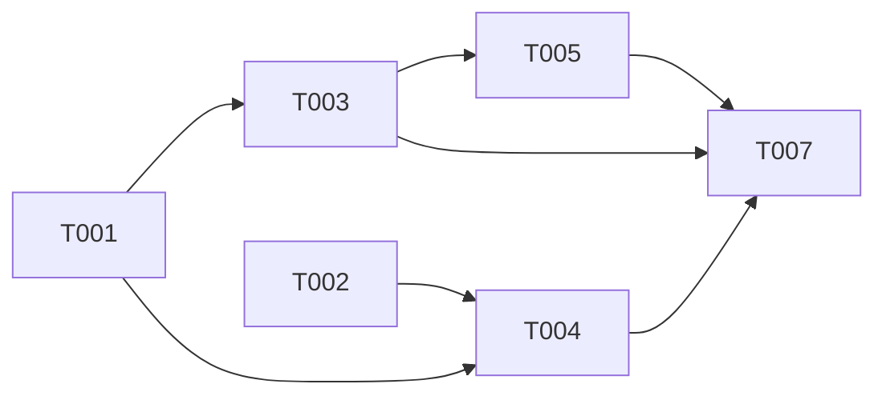

# Plan: LCA-Based Artifact Grounding (Metadata Propagation)

## Overview

- **Source**: Issue #14
- **Issue**: #14
- **Created**: 2026-02-06
- **Approach**: Pragmatic — faithful to paper Algorithm 1, minimal files, clean pipeline integration

## Problem 1-Pager

### Context

RPG-Encoder currently implements 2 of 3 encoding phases:
1. **Semantic Lifting** (Phase 1) — extracts entities, creates LowLevelNodes with `metadata.path`
2. **Structural Reorganization** (Phase 2) — creates HighLevelNodes with semantic features but NO physical path anchoring
3. **Artifact Grounding** (Phase 3) — only dependency injection exists; metadata propagation is missing

After Phase 2, HighLevelNodes like `domain:GraphStorage/node management/CRUD operations` have semantic descriptions but no connection to physical file paths. This means tools like `searchByPath()` cannot find HighLevelNodes, and abstract-to-concrete navigation is broken.

### Problem

HighLevelNodes lack `metadata.path`, making them invisible to path-based search and disconnected from the physical codebase structure.

### Goal

Implement Algorithm 1 from RPG-Encoder §3.3: Trie-based bottom-up LCA propagation that assigns `metadata.path` to every HighLevelNode by computing the Lowest Common Ancestor of its leaf descendants' directory paths.

### Non-Goals

- Semantic Compatibility Routing (separate issue)
- Method-level dependency edges
- DataFlowEdge creation

### Constraints

- Must work with both legacy (SQLiteStore) and new (ContextStore) backends
- No LLM calls required — this is a pure algorithmic step
- Must not break existing serialization format
- `StructuralMetadata.path` is a single string; multi-directory nodes use `metadata.extra.paths`

## Architecture Decision

**Approach**: Create a single new module `src/encoder/grounding.ts` containing:
1. `PathTrie` class — prefix tree for directory path analysis
2. `ArtifactGrounder` class — orchestrates bottom-up propagation over the RPG

**Rationale**:
- The algorithm is self-contained and doesn't depend on LLM or external services
- A single file keeps the implementation cohesive (~150-200 LOC)
- `ArtifactGrounder` follows the same pattern as `DomainDiscovery` and `HierarchyBuilder` — a class that takes `RepositoryPlanningGraph` and operates on it
- No existing code needs structural changes; the encoder just calls `groundArtifacts()` between Phase 2 and dependency injection

**Key Design Decisions**:

1. **PathTrie as internal class**: Not exported from the module since it's an implementation detail of the LCA computation. If future modules need it, it can be extracted.

2. **Single `metadata.path` for single-LCA nodes**: When all leaf files share a common directory prefix (LCA returns one path), store it in `metadata.path` with `entityType: 'module'`. When multiple branching paths exist, store the lexicographically first path in `metadata.path` and all paths in `metadata.extra.paths` as a string array. This preserves backward compatibility with existing `StructuralMetadata` while supporting multi-directory semantic nodes.

3. **Post-order traversal via recursive DFS**: Follow the paper exactly — propagate from leaves up, collecting directory sets at each level.

4. **Integration point**: Between `buildFunctionalHierarchy()` and `injectDependencies()` in `encoder.ts:181-184`. The comment already says "Phase 3: Artifact Grounding" — we split it into 3a (metadata propagation) and 3b (dependency injection).

## Tasks

- [ ] T001 [P] Create `src/encoder/grounding.ts` with `PathTrie` and `ArtifactGrounder` classes (file: src/encoder/grounding.ts)
- [ ] T002 [P] Write unit tests for `PathTrie` — branching detection, single-path, multi-path, empty input (file: tests/encoder/grounding.test.ts)
- [ ] T003 Integrate `ArtifactGrounder` into encoder pipeline between Phase 2 and dependency injection (depends on T001, file: src/encoder/encoder.ts)
- [ ] T004 Write unit tests for `ArtifactGrounder` — verify HighLevelNodes get metadata.path, multi-LCA nodes get extra.paths, empty children handled (depends on T001, T002, file: tests/encoder/grounding.test.ts)
- [ ] T005 Verify `searchByPath` works with grounded HighLevelNodes; update if needed to also match `metadata.extra.paths` (depends on T003, file: src/graph/rpg.ts)
- [ ] T006 [P] Update implementation-status.md to mark artifact grounding as implemented (file: docs/implementation-status.md)
- [ ] T007 Run full test suite and fix any regressions (depends on T003, T004, T005)

## Dependencies



**Parallel Group 1**: T001, T002, T006 (independent)
**Sequential**: T001 → T003 → T005 → T007
**Sequential**: T001 + T002 → T004 → T007

## Key Files

### Create
- `src/encoder/grounding.ts` — PathTrie + ArtifactGrounder (~150-200 LOC)
- `tests/encoder/grounding.test.ts` — Unit tests for grounding module

### Modify
- `src/encoder/encoder.ts` — Add `groundArtifacts()` call between Phase 2 and dependency injection (lines 180-184)
- `docs/implementation-status.md` — Mark artifact grounding as implemented (line 150-151)

### Read-only (context)
- `src/graph/node.ts` — StructuralMetadata type definition
- `src/graph/rpg.ts` — RPG API (getHighLevelNodes, getChildren, updateNode)
- `src/encoder/reorganization/hierarchy-builder.ts` — How HighLevelNodes are created
- `docs/arXiv-2602.02084v1/algos/meta_prog.tex` — Algorithm 1 pseudocode

## Algorithm Specification

From paper Algorithm 1 (Appendix A.1.3):

```
PROPAGATE(v):
  if v is Leaf:
    return { dir(path(v)) }           // Base: file's directory

  S = ∅
  for child in Children(v):
    S = S ∪ PROPAGATE(child)          // Recursive aggregation

  π̂(v) = COMPUTE_LCA(S)              // Assign grounded paths
  return S                             // Pass full coverage upward

COMPUTE_LCA(S):
  Trie = BuildTrie(S)                  // Prefix tree from directory set
  L = ∅
  for node in PostOrder(Trie):         // Bottom-up for optimal pruning
    if node.is_branching() or node.is_terminal():
      L.add(node.path)                 // Meaningful boundary
      PruneSubtree(node)               // Consolidate sub-paths
  return L
```

**Key semantics**:
- `is_branching()` = node has >1 children in the Trie (paths diverge here)
- `is_terminal()` = node is a leaf in the Trie (deepest unique prefix)
- `PruneSubtree()` = remove children to prevent redundant deeper paths
- `dir(path)` = directory portion of a file path (e.g., `src/graph` from `src/graph/node.ts`)

## Verification

### Automated Tests

- [ ] PathTrie correctly identifies branching nodes for divergent paths
- [ ] PathTrie returns single path when all inputs share one directory
- [ ] PathTrie returns root when paths span unrelated directories
- [ ] ArtifactGrounder populates `metadata.path` for all HighLevelNodes
- [ ] ArtifactGrounder sets `metadata.entityType` to `'module'` for grounded nodes
- [ ] ArtifactGrounder stores multiple paths in `metadata.extra.paths` when LCA branches
- [ ] ArtifactGrounder handles HighLevelNodes with no leaf descendants gracefully (no metadata assigned)
- [ ] `searchByPath` matches HighLevelNodes via `metadata.path` and `metadata.extra.paths`
- [ ] Encoder integration: full encode produces HighLevelNodes with metadata
- [ ] Existing tests pass (no regressions in search, serialization, evolution)

### Manual Testing

- [ ] Encode the RPG project itself and verify HighLevelNodes have paths
- [ ] Verify `searchByPath('src/encoder/*')` returns relevant HighLevelNodes

### Acceptance Criteria Check

- [ ] AC-1: Bottom-up propagation correctly computes LCA for shared paths
- [ ] AC-2: Abstract features are anchored to physical code entities
- [ ] AC-3: Metadata propagation is efficient (trie-based)

## Review Status

- **Reviewed**: 2026-02-06
- **Result**: APPROVED
- **User Approved**: Yes
- **Issue**: #14
- **Comment**: https://github.com/pleaseai/rpg/issues/14#issuecomment-3860757598

## Notes

- The algorithm is O(N * D) where N = number of leaf paths and D = max directory depth — efficient for any practical codebase
- `searchByPath` in `rpg.ts` already filters by `attrs.path` — HighLevelNodes will automatically become searchable once `metadata.path` is populated, requiring no changes to the search logic itself (T005 may be a no-op if the existing implementation already handles it)
- The Trie is rebuilt per-node call to `computeLCA()` — this is intentional per the paper and keeps the implementation stateless. The total number of Trie constructions equals the number of HighLevelNodes (typically 20-50), each with small input sets
