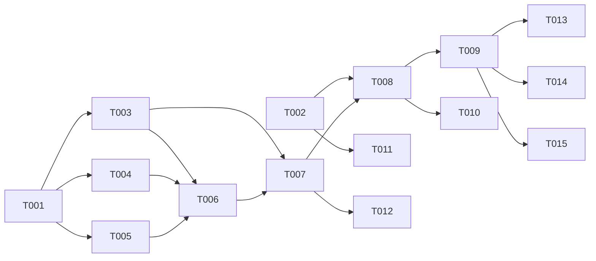

# Plan: RPG-Encoder Evolution (Commit-Level Incremental Updates)

## Overview

- **Source**: Issue #10
- **Issue**: #10
- **Created**: 2026-02-06
- **Approach**: Paper-Faithful — Implement the 3 atomic operations from RPG-Encoder §4 (arXiv:2602.02084)

## Architecture Decision

Implement the paper's Evolution system faithfully as a separate `src/encoder/evolution/` module. This keeps the encoding pipeline clean (full encode vs incremental evolve are separate concerns) while reusing existing infrastructure (RPG CRUD, SemanticExtractor, ASTParser, LLMClient).

**Rationale**:
- The paper defines 3 clear algorithms (Delete, Modify, Insert) with distinct responsibilities
- Evolution is a bounded subsystem that only touches changed entities — separate module prevents encoder.ts from growing (already 721 LOC)
- Existing CRUD infrastructure (addNode, removeNode, updateNode, getParent, getChildren) is complete
- Both SQLite and Surreal stores support CASCADE deletion (edges auto-delete with nodes)

**Key Design Decisions**:
1. **Git diff via `git` CLI**: Use `Bun.spawn` to call `git diff` and `git show` — no external git library needed (Bun project, git always available)
2. **Entity matching by qualified name**: Use `filePath:entityType:qualifiedName` (without line numbers) for stable matching across diffs, since line numbers shift. For nested entities use `ParentClass.method` format.
3. **Semantic drift via embedding cosine similarity**: Reuse existing embedding infrastructure (HuggingFace/OpenAI) for drift threshold. Default threshold 0.3 (conservative — 30% semantic change). Fallback to keyword Jaccard similarity when no embedding provider configured.
4. **LLM routing prompts**: New prompts for FindBestParent (semantic routing) and SemanticShift (drift assessment)
5. **RPG reference via parameter**: `evolve(rpg, options)` accepts RPG as parameter rather than storing state in encoder — more flexible, stateless design

## Module Structure

```
src/encoder/evolution/
├── index.ts           # Public exports
├── types.ts           # EvolutionOptions, DiffResult, ChangeEvent types
├── diff-parser.ts     # Git diff parsing → (U+, U-, U~) categorization
├── operations.ts      # 3 atomic operations: deleteNode, modifyNode, insertNode
├── semantic-router.ts # FindBestParent LLM-based routing
├── evolve.ts          # Main orchestrator: RPGEvolver class
└── prompts.ts         # LLM prompt templates for routing & drift detection
```

## Tasks

- [ ] T001 [P] Define Evolution types and interfaces (file: src/encoder/evolution/types.ts)
- [ ] T002 [P] Implement git diff parser — ParseUnitDiff (file: src/encoder/evolution/diff-parser.ts)
- [ ] T003 Implement DeleteNode with recursive pruning — PruneOrphans (depends on T001, file: src/encoder/evolution/operations.ts)
- [ ] T004 Implement LLM semantic routing — FindBestParent (depends on T001, file: src/encoder/evolution/semantic-router.ts)
- [ ] T005 Define LLM prompts for routing and drift detection (depends on T001, file: src/encoder/evolution/prompts.ts)
- [ ] T006 Implement InsertNode with semantic routing and dependency injection (depends on T003, T004, T005, file: src/encoder/evolution/operations.ts)
- [ ] T007 Implement ProcessModification with semantic drift detection (depends on T003, T006, file: src/encoder/evolution/operations.ts)
- [ ] T008 Implement RPGEvolver orchestrator (depends on T002, T006, T007, file: src/encoder/evolution/evolve.ts)
- [ ] T009 Wire evolve() in RPGEncoder to delegate to RPGEvolver (depends on T008, file: src/encoder/encoder.ts)
- [ ] T010 Create module index with public exports (depends on T008, file: src/encoder/evolution/index.ts)
- [ ] T011 Write unit tests for diff-parser with AC-1 verification (depends on T002, file: tests/evolution/diff-parser.test.ts)
- [ ] T012 Write unit tests for operations with AC-2/3/4 verification (depends on T007, file: tests/evolution/operations.test.ts)
- [ ] T013 Write integration test with real git repo and cost measurement (depends on T009, file: tests/evolution/evolution.integration.test.ts)
- [ ] T014 Update existing encoder evolve test (depends on T009, file: tests/encoder.test.ts)
- [ ] T015 Update implementation-status.md (depends on T009, file: docs/implementation-status.md)

## Dependencies



**Parallel Group 1**: T001, T002 (independent — types and diff parser)
**Parallel Group 2**: T003, T004, T005 (depend on T001, independent of each other)
**Sequential**: T006 → T007 → T008 → T009
**Parallel Group 3**: T010, T011, T012, T013, T014, T015 (post-integration)

## Key Files

### Files to Create

| File | Purpose |
|------|---------|
| `src/encoder/evolution/types.ts` | Type definitions: EvolutionOptions, DiffResult, ChangeEvent, DriftConfig |
| `src/encoder/evolution/diff-parser.ts` | Git diff parsing: commit range → changed entities (U+, U-, U~) |
| `src/encoder/evolution/operations.ts` | 3 atomic operations: DeleteNode, InsertNode, ProcessModification |
| `src/encoder/evolution/semantic-router.ts` | FindBestParent: LLM-based recursive top-down routing |
| `src/encoder/evolution/prompts.ts` | LLM prompt templates for semantic routing and drift detection |
| `src/encoder/evolution/evolve.ts` | RPGEvolver orchestrator class |
| `src/encoder/evolution/index.ts` | Module barrel exports |
| `tests/evolution/diff-parser.test.ts` | Unit tests for diff parser |
| `tests/evolution/operations.test.ts` | Unit tests for atomic operations |
| `tests/evolution/evolution.integration.test.ts` | Integration test with real git fixture |

### Files to Modify

| File | Change |
|------|--------|
| `src/encoder/encoder.ts` | Change `evolve()` signature to accept RPG parameter, delegate to RPGEvolver, return `EvolutionResult` |
| `tests/encoder.test.ts` | Update stub test to test actual evolution behavior |
| `docs/implementation-status.md` | Mark Evolution as implemented |

### Existing Files to Reuse (read-only)

| File | What We Reuse |
|------|---------------|
| `src/graph/rpg.ts` | All CRUD methods, getParent, getChildren, removeNode |
| `src/encoder/semantic.ts` | SemanticExtractor for feature re-extraction |
| `src/encoder/cache.ts` | SemanticCache for invalidation |
| `src/encoder/embedding.ts` | Embedding for drift detection (cosine similarity) |
| `src/utils/ast.ts` | ASTParser for entity extraction from new/modified files |
| `src/utils/llm.ts` | LLMClient for routing prompts |
| `src/utils/vector.ts` | cosineSimilarity() for drift threshold |

## Task Details

### T001: Evolution Types

```typescript
// Core types
interface EvolutionOptions {
  commitRange: string          // e.g., "HEAD~1..HEAD", "abc123..def456"
  repoPath: string
  driftThreshold?: number      // default 0.3 (cosine distance — conservative 30% change)
  useLLM?: boolean             // default true
  semantic?: SemanticOptions
  cache?: CacheOptions
}

interface EvolutionResult {
  inserted: number
  deleted: number
  modified: number
  rerouted: number             // modified entities that triggered re-routing
  prunedNodes: number          // empty ancestors removed
  duration: number
  llmCalls: number             // for cost measurement (AC-5)
}

// Change categories from ParseUnitDiff
type ChangeEvent =
  | { type: 'insertion'; entity: ChangedEntity }
  | { type: 'deletion'; entity: ChangedEntity }
  | { type: 'modification'; oldEntity: ChangedEntity; newEntity: ChangedEntity }

interface ChangedEntity {
  id: string                   // filePath:entityType:qualifiedName
  filePath: string
  entityType: EntityType
  entityName: string
  qualifiedName: string        // e.g., "MyClass.myMethod" for nested entities
  sourceCode?: string
  startLine?: number
  endLine?: number
}

interface DiffResult {
  insertions: ChangedEntity[]  // U+
  deletions: ChangedEntity[]   // U-
  modifications: Array<{       // U~
    old: ChangedEntity
    new: ChangedEntity
  }>
}
```

### T002: Git Diff Parser

**Git commands** (via `Bun.spawn`):
- `git diff <commitRange> --name-status` → file-level changes (A/M/D)
- `git show <newRev>:<file>` and `git show <oldRev>:<file>` → full file content for each changed file
- Then ASTParser to extract entities from both old and new versions of modified files

**Entity Matching Strategy**:
- Match by qualified name: `filePath:entityType:qualifiedName`
- Qualified name for nested entities: `ParentClass.method` (e.g., `MyClass.myMethod`)
- For top-level entities: just `entityName`
- Ignore line numbers (they shift with diffs)

**File-Level to Entity-Level Conversion**:
1. For deleted files (D): Extract entities from old revision → mark all as U-
2. For added files (A): Extract entities from new revision → mark all as U+
3. For modified files (M):
   - Extract entities from both old and new revisions
   - Match entities by qualified name
   - U- = entities only in old (deleted within file)
   - U+ = entities only in new (added within file)
   - U~ = entities in both with different source code (modified)

**Edge Cases**:
- File rename: Treat as delete old + insert new (use `git diff -M` to detect renames, but still handle as D+A)
- Binary files: Skip (no AST parsing possible)
- Merge commits: Use `git diff <parent1>..<merge>` (single parent only)

### T003: DeleteNode with Recursive Pruning

Direct translation of Algorithm 1 (deletion.tex):
1. `getNode(id)` → get target node
2. If node not found, return (idempotent)
3. `getParent(id)` → remember parent before removal
4. `removeNode(id)` → CASCADE deletes all incident edges (functional + dependency)
5. `pruneOrphans(parent)` → recursive bottom-up check:
   - If parent is null or root → stop
   - If parent has no remaining children → remove parent, recurse to grandparent
   - Track pruned node count for EvolutionResult.prunedNodes

### T004: Semantic Router (FindBestParent)

Direct translation of Algorithm 3 (insertion.tex):
1. Start at root node of the RPG
2. Get abstract children (HighLevelNode children via `getChildren()` + `isHighLevelNode()`)
3. If no abstract children → return current node (base case)
4. Build context: `[(childId, childFeature.description), ...]`
5. LLM prompt (from T005): "Given feature X, which category fits best among these options?"
6. If LLM chose a child → recurse into that child
7. If LLM said "none" → return current node (no child is a better fit)

**Fallback (useLLM: false)**: Use cosine similarity between entity feature embedding and each child's feature embedding to select best parent.

### T005: LLM Prompts

Two new prompt templates:
1. **Semantic Routing Prompt**: Given a list of abstract categories (id + feature description) and a new entity's feature, select the category that is the most semantically compatible parent. Return the category ID or "none" if no child fits well.
2. **Drift Detection Prompt** (secondary — primary detection uses cosine similarity): Given old and new semantic features for the same entity, assess whether semantic intent has fundamentally changed (yes/no with brief reason).

### T006: InsertNode with Semantic Routing and Dependency Injection

Direct translation of Algorithm 3 (insertion.tex):
1. Extract semantic feature via SemanticExtractor
2. Find best parent via `FindBestParent` (T004)
3. Create LowLevelNode with `rpg.addLowLevelNode()`
4. Create FunctionalEdge from parent to new node with `rpg.addFunctionalEdge()`
5. **Inject dependency edges**: Parse the new entity's file to extract imports, then create DependencyEdges to existing nodes in the graph. Reuse the import resolution logic from `RPGEncoder.resolveImportPath()` and `extractFileDependencies()` — extract these as shared utilities or call them via composition.
6. Invalidate SemanticCache for the new entity's file path

### T007: ProcessModification with Semantic Drift Detection

Direct translation of Algorithm 2 (modified.tex):

**Processing order** (from paper): U- first, then U+, then U~

1. **Process deletions (U-)**: For each deleted entity, call `DeleteNode` (T003)
2. **Process insertions (U+)**: For each new entity, call `InsertNode` (T006)
3. **Process modifications (U~)**: For each modified entity:
   a. Re-extract semantic feature via SemanticExtractor for the new version
   b. Compute semantic drift:
      - **Primary**: Get embedding for old feature and new feature, calculate cosine distance = `1 - cosineSimilarity(oldEmbed, newEmbed)`
      - **Fallback** (no embedding provider): Use keyword Jaccard distance = `1 - |old.keywords ∩ new.keywords| / |old.keywords ∪ new.keywords|`
   c. If distance > `driftThreshold` (default 0.3):
      - Call `DeleteNode(old.id)` — semantic re-routing (logic drift)
      - Call `InsertNode(new)` — re-route to semantically correct location
      - Increment `EvolutionResult.rerouted`
   d. Else:
      - Call `rpg.updateNode(id, { feature: newFeature })` — in-place update
      - Increment `EvolutionResult.modified`
   e. Invalidate SemanticCache for the modified entity

### T008: RPGEvolver Orchestrator

```typescript
class RPGEvolver {
  constructor(rpg: RepositoryPlanningGraph, options: EvolutionOptions)

  async evolve(): Promise<EvolutionResult> {
    // 1. Parse git diff → DiffResult (via DiffParser)
    // 2. Process deletions first (structural hygiene) — paper scheduling
    // 3. Process modifications (may trigger delete+insert for drift)
    // 4. Process insertions last (new entities route into clean hierarchy)
    // 5. Save semantic cache
    // 6. Return statistics (including llmCalls count)
  }
}
```

Scheduling order (from paper §A.2.1): Delete → Modify → Insert.
This prevents dead branches from accumulating and ensures new entities route into a clean hierarchy.

### T009: Wire RPGEncoder.evolve()

**Changes to `src/encoder/encoder.ts`**:

1. Change `evolve()` method signature to accept RPG as first parameter:
```typescript
async evolve(
  rpg: RepositoryPlanningGraph,
  options: { commitRange: string }
): Promise<EvolutionResult> {
  const evolver = new RPGEvolver(rpg, {
    commitRange: options.commitRange,
    repoPath: this.repoPath,
    driftThreshold: undefined, // use default
    useLLM: this.options.semantic?.useLLM,
    semantic: this.options.semantic,
    cache: this.options.cache,
  })
  return evolver.evolve()
}
```

2. Return type changes from `Promise<void>` to `Promise<EvolutionResult>`

3. Import `RPGEvolver` from `./evolution` and `EvolutionResult` from `./evolution/types`

### T010: Module Index

Public exports from `src/encoder/evolution/index.ts`:
- `RPGEvolver`
- `DiffParser`
- `EvolutionOptions`, `EvolutionResult`, `DiffResult`, `ChangedEntity`, `ChangeEvent`

### T011: Unit Tests for Diff Parser (AC-1 Verification)

Tests in `tests/evolution/diff-parser.test.ts`:
- Parse `git diff --name-status` output for A/M/D file statuses
- Extract entities from old/new file revisions via ASTParser
- Categorize into (U+, U-, U~) correctly
- **AC-1 verification**: Mock git diff with 10 files total, 3 changed → verify only 3 files are parsed (unchanged files skipped)
- Edge cases: file rename detection, binary file skip, empty diff, single-hunk vs multi-hunk

### T012: Unit Tests for Operations (AC-2/3/4 Verification)

Tests in `tests/evolution/operations.test.ts`:

**DeleteNode tests (AC-2)**:
- Verify node removal from graph
- Verify functional edges removed (CASCADE)
- Verify dependency edges removed (CASCADE)
- Verify recursive pruning removes empty ancestor HighLevelNodes
- Verify pruning stops at root or first non-empty ancestor

**InsertNode tests (AC-4)**:
- Verify FindBestParent routes to correct semantic parent (mock LLM response)
- Verify functional edge created from parent to new node
- Verify dependency edges injected for new entity's imports

**ProcessModification tests (AC-3)**:
- Low drift (cosine distance < 0.3) → in-place update, node stays in same location
- High drift (cosine distance > 0.3) → delete + insert (re-routing), node moves to new parent
- Cache invalidation for modified entities

### T013: Integration Test with Cost Measurement (AC-5 Verification)

Tests in `tests/evolution/evolution.integration.test.ts`:
- Encode `tests/fixtures/superjson/` repo → get baseline RPG
- Use a real commit range from the fixture's git history
- Run `evolve()` with the commit range
- **Verify graph consistency**: node counts reflect additions/removals, edges are valid
- **Verify AC-1**: Only changed files' entities were processed
- **Verify AC-5**: Track `EvolutionResult.llmCalls` vs estimated full re-encode calls; assert significant reduction (target > 90%)

### T014: Update Encoder Test

Update `tests/encoder.test.ts:52-54` stub test:
- Change from `evolve({ commitRange: ... })` to `evolve(rpg, { commitRange: ... })`
- Verify it returns `EvolutionResult` with expected fields

### T015: Update Implementation Status

In `docs/implementation-status.md`:
- Move "RPG-Encoder: Evolution" from §2.2 "Not Implemented" to §1 "Implemented"
- Add section for Evolution module with file locations and feature descriptions

## Verification

### Automated Tests

- [ ] Unit tests for diff-parser: parse git diff output, categorize correctly, skip unchanged files
- [ ] Unit tests for DeleteNode: verify node removal + edge CASCADE + recursive pruning of empty ancestors
- [ ] Unit tests for InsertNode: verify LLM routing places entity under correct parent + dependency edge injection
- [ ] Unit tests for ProcessModification: test both in-place update and re-routing paths + cache invalidation
- [ ] Integration test: encode real repo fixture, evolve with real commits, verify graph consistency
- [ ] Cost measurement: track LLM calls in evolve vs full re-encode, assert > 90% reduction
- [ ] Edge cases: empty diffs, file renames, binary files, merge commits

### Manual Testing

- [ ] Run `bun run src/cli.ts encode ./tests/fixtures/superjson` then test evolve with real commits
- [ ] Verify cost reduction: compare LLM calls for full encode vs evolve

### Acceptance Criteria Check

- [ ] AC-1: Process only changed files based on commit diffs (verified in T011 — unchanged files skipped)
- [ ] AC-2: Clean up nodes/edges for deleted entities with ancestor pruning (verified in T012 — CASCADE + pruning)
- [ ] AC-3: Detect semantic changes in modified entities and update appropriately (verified in T012 — drift detection)
- [ ] AC-4: Route new entities to optimal positions via LLM (verified in T012 — FindBestParent routing)
- [ ] AC-5: Measure cost reduction vs full re-encoding (verified in T013 — llmCalls tracking, target > 90%)

## Notes

- **Entity ID stability**: Current encoder uses `filePath:entityType:entityName:startLine` — evolution matches on `filePath:entityType:qualifiedName` (without line numbers) since lines shift in diffs
- **Scheduling order**: Paper §A.2.1 specifies Delete → Modify → Insert to maintain structural consistency
- **Drift threshold**: Default 0.3 cosine distance (conservative — 30% semantic change). Configurable via `EvolutionOptions.driftThreshold`. Will be tuned based on evaluation.
- **No external git library**: Use `Bun.spawn` with `git` CLI commands for simplicity — no `simple-git` or `nodegit` dependency
- **Test fixture**: `tests/fixtures/superjson/` has `.git` directory with real commit history for integration testing
- **Embedding fallback**: If no embedding provider configured, use keyword Jaccard similarity for drift detection
- **Cache invalidation**: SemanticCache entries are invalidated for deleted/modified entities during evolution operations
- **Dependency injection for inserts**: Reuse import resolution logic from `RPGEncoder.resolveImportPath()` via composition — extract as shared utility if needed during implementation
