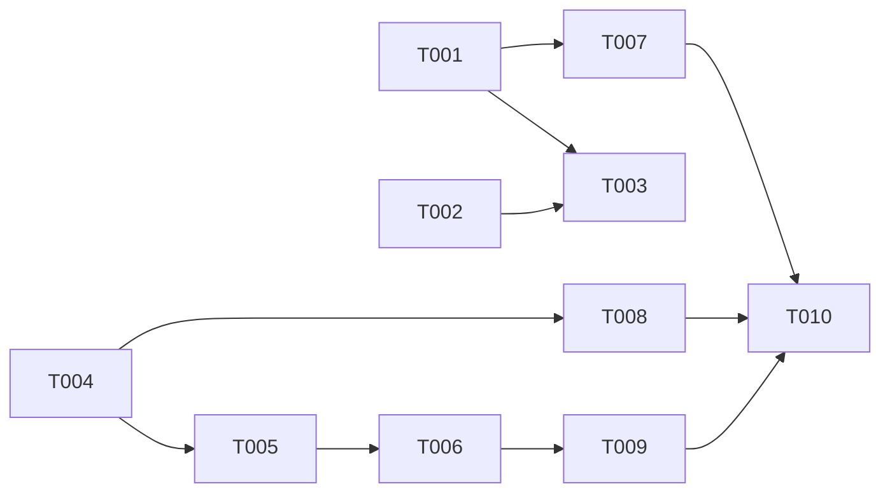

# Plan: Improve Semantic Lifting (naming rules, file-level aggregation)

## Overview

- **Source**: Issue #11
- **Issue**: #11
- **Created**: 2026-02-06
- **Approach**: Pragmatic — modify existing `SemanticExtractor` and `RPGEncoder` to align with paper (RPG-Encoder §3.1)

## Architecture Decision

The paper specifies three improvements for Semantic Lifting (Phase 1):

1. **Feature naming rules**: 11 specific constraints on semantic feature descriptions
2. **File-level aggregation**: Synthesize function-level features into file-level summary
3. **Functional edge auto-generation**: File → function edges during Phase 1

Current implementation handles these partially:
- LLM prompt mentions "verb + object format" but doesn't enforce the full naming ruleset
- File-level entities get heuristic descriptions only (no aggregation from children)
- File → function edges exist in `createFileToEntityEdges()` but run in Phase 2

**Approach**: Modify two existing files (`src/encoder/semantic.ts`, `src/encoder/encoder.ts`) rather than creating new abstractions. Add a validation/normalization layer for feature naming, a file-level aggregation method, and reorder the encoding pipeline.

## Tasks

- [ ] T001 [P] Add feature naming validation to `SemanticExtractor` (file: src/encoder/semantic.ts)
- [ ] T002 [P] Update LLM system prompt with paper's 11 naming rules (file: src/encoder/semantic.ts)
- [ ] T003 Add heuristic feature name normalization (depends on T001, file: src/encoder/semantic.ts)
- [ ] T004 [P] Add `aggregateFileFeatures()` method to `SemanticExtractor` (file: src/encoder/semantic.ts)
- [ ] T005 Integrate file-level aggregation into `RPGEncoder.extractEntities()` (depends on T004, file: src/encoder/encoder.ts)
- [ ] T006 Reorder Phase 1 to create file→function edges during entity extraction (depends on T005, file: src/encoder/encoder.ts)
- [ ] T007 Add unit tests for feature naming validation (depends on T001, file: tests/semantic.test.ts)
- [ ] T008 Add unit tests for file-level aggregation (depends on T004, file: tests/semantic.test.ts)
- [ ] T009 Add encoder tests for file→function edge generation in Phase 1 (depends on T006, file: tests/encoder.test.ts)
- [ ] T010 Run full test suite and fix regressions (depends on T007, T008, T009)

## Dependencies



**Parallel Group 1**: T001, T002, T004 (independent)
**Sequential**: T001 → T003, T004 → T005 → T006
**Tests**: T007, T008, T009 (after their dependencies)
**Final**: T010 (after all tests)

## Key Files

### Files to Modify
- `src/encoder/semantic.ts` — SemanticExtractor: add validation, aggregation, update prompts
- `src/encoder/encoder.ts` — RPGEncoder: integrate aggregation, reorder edge creation
- `tests/semantic.test.ts` — Add naming validation and aggregation tests
- `tests/encoder.test.ts` — Add file→function edge tests

### Files for Reference (read-only)
- `docs/arXiv-2602.02084v1/prompts/semantic_parsing.tex` — Paper's 11 naming rules
- `docs/arXiv-2602.02084v1/appendix/methods/extraction.tex` — Paper's semantic lifting spec
- `src/utils/llm.ts` — LLMClient interface
- `src/encoder/cache.ts` — SemanticCache (may need cache key updates)
- `src/graph/node.ts` — SemanticFeature schema (subFeatures field)

## Task Details

### T001: Add feature naming validation to `SemanticExtractor`

Add a `validateFeatureName(description: string): string` method that enforces the paper's naming rules:

1. **Lowercase only**: Normalize to lowercase
2. **Word count check**: 3-8 words; if >8, truncate; if <3, keep as-is (heuristic may produce short names)
3. **Vague verb detection**: Replace vague verbs (`handle`, `process`, `deal with`) with more specific ones where possible, or flag for LLM retry
4. **Implementation detail removal**: Strip common implementation keywords (loop, iterate, if/else, array, dict, list, map)
5. **No punctuation**: Remove trailing periods, commas, semicolons
6. **Single responsibility check**: If description contains "and" connecting two actions, split into `description` + `subFeatures`

Call this in `validateFeature()` after LLM response and in `extractWithHeuristic()` after generating descriptions.

### T002: Update LLM system prompt with paper's 11 naming rules

Replace the current minimal system prompt with the paper's full prompt structure from `prompts/semantic_parsing.tex`.

**11 Feature Naming Rules** (from semantic_parsing.tex lines 43-53):
1. Use verb + object format (e.g., `load config`, `validate token`)
2. Use lowercase English only
3. Describe purpose not implementation (focus on what, not how)
4. Each feature must express one single responsibility
5. If a method has multiple responsibilities, split into multiple atomic features
6. Keep features short and atomic (prefer 3-8 words; no full sentences; no punctuation)
7. Avoid vague verbs (`handle`, `process`, `deal with`); prefer precise verbs (`load`, `validate`, `convert`, `update`, `serialize`, `compute`, `check`, `transform`)
8. Avoid implementation details (no loops, conditionals, data structures, control flow)
9. Avoid libraries/frameworks/formats (say `serialize data`, not `pickle object` / `save to json`)
10. Prefer domain/system semantics over low-level actions (`manage session` > `update dict`)
11. Avoid chaining actions (don't write `initialize config and register globally`; split into separate features)

**6 Feature Extraction Principles** (from semantic_parsing.tex lines 34-41):
1. Focus on purpose and behavior — what role the function serves
2. Do NOT describe implementation details, variable names, or internal logic
3. If a function performs multiple responsibilities, break them down into separate features
4. Use function name, signature, and code to infer intent
5. Only analyze functions in the current input — do not guess other functions
6. Do not omit any function, including utility or helper functions

- Update output format to support multiple features per entity (subFeatures)
- Keep JSON response format compatible with existing `SemanticFeature` interface

### T003: Add heuristic feature name normalization

**Application scope**:
- Applies when `useLLM: false` (heuristic mode)
- Also used as fallback if LLM response is malformed
- NOT applied as post-processing when LLM succeeds (LLM output already follows naming rules via T002)

Update `generateDescription()` and `generateFunctionDescription()` to produce names that better conform to paper rules:
- Use verb + object format consistently
- Avoid "function that" prefix (current default fallback)
- Replace "class representing X" with "define X" or "implement X"
- Replace "method to X in Y" with just "X" (verb + object)

### T004: Add `aggregateFileFeatures()` method

New method in `SemanticExtractor`:

```typescript
async aggregateFileFeatures(
  childFeatures: SemanticFeature[],
  fileName: string,
  filePath: string,
): Promise<SemanticFeature>
```

**Scope clarification**:
- Aggregate only **direct children** (functions/classes defined at file level)
- Exclude nested methods (they belong to their parent class, not the file directly)
- Rationale: Paper's extraction.tex describes "functions and classes" as the semantic units; single-level aggregation is sufficient for initial implementation

**LLM path**: Send child features as context, ask LLM to synthesize a file-level summary.
**Heuristic path**: Concatenate child descriptions, deduplicate keywords, use file name as base.

The aggregated feature becomes the file-level node's semantic feature, replacing the current heuristic-only `generateFileDescription()`.

### T005: Integrate file-level aggregation into encoder

Modify `RPGEncoder.extractEntities()`:

1. First, extract all function/class/method entities from the file (existing logic)
2. Then, collect their semantic features
3. Call `aggregateFileFeatures()` with the collected features
4. Use the aggregated result as the file-level entity's feature (instead of current heuristic)

This changes the extraction order: child entities first, then file entity.

### T006: Reorder file→function edge creation

Currently, file→function edges are created in `buildFunctionalHierarchy()` via `createFileToEntityEdges()`.

Per the paper, these edges should be a natural outcome of file-level aggregation in Phase 1. Move the edge creation to happen immediately after entity extraction for each file, inside the Phase 1 loop in `encode()`.

This means:
- `extractEntities()` returns entities AND edge pairs (file→child)
- `encode()` creates both nodes and file→function edges in Phase 1
- `buildFunctionalHierarchy()` no longer calls `createFileToEntityEdges()` (remove that call)

### T007-T009: Tests

**T007 — Naming validation tests**:
- Valid names pass through unchanged
- Vague verbs are detected
- Long descriptions are truncated
- Punctuation is removed
- "and" splits into subFeatures
- Implementation details are stripped

**T008 — File-level aggregation tests**:
- Aggregation with multiple child features produces a valid summary
- Heuristic aggregation (no LLM) concatenates/summarizes
- Keywords are merged and deduplicated
- Empty child features list falls back to file name

**T009 — Edge generation tests**:
- File→function edges are created during Phase 1
- Edge count matches entity count (minus file entity itself)
- `buildFunctionalHierarchy()` no longer creates file→function edges (only directory→file)

## Verification

### Automated Tests
- [ ] Unit tests pass for feature naming validation
- [ ] Unit tests pass for file-level aggregation
- [ ] Encoder tests pass for file→function edge generation
- [ ] Full test suite passes (`bun run test`)
- [ ] Lint passes (`bun run lint`)
- [ ] Type check passes (`bun run typecheck`)

### Manual Testing
- [ ] Encode a real project and verify feature names follow verb+object format
- [ ] Verify file-level nodes have synthesized descriptions (not just "X module in Y")
- [ ] Verify functional edges include file→function relationships

### Acceptance Criteria Check
- [ ] Semantic features follow verb + object naming convention
- [ ] File-level nodes have synthesized feature descriptions
- [ ] Functional edges correctly link file nodes to their function children

## Review Status

- **Reviewed**: 2026-02-06
- **Result**: APPROVED
- **Reviewer**: please:plan-reviewer agent
- **Recommendations incorporated**: Explicit 11 naming rules in T002, scope clarification for T003 and T004

## Notes

- **Cache compatibility**: The feature naming normalization may produce different outputs than cached entries. The existing content-hash-based invalidation in `SemanticCache` handles this correctly — if source code hasn't changed, cached features are still valid. Only new extractions will get the improved naming.
- **LLM prompt backward compatibility**: The updated prompt still returns the same `SemanticFeature` JSON format. The `subFeatures` field is already defined and supported.
- **Evolution pipeline**: The evolution pipeline in `src/encoder/evolution/` calls `SemanticExtractor` for new/modified entities. It will automatically benefit from the improved naming rules without changes.
- **Heuristic mode**: All improvements include a heuristic fallback path for offline/testing use (`useLLM: false`).
