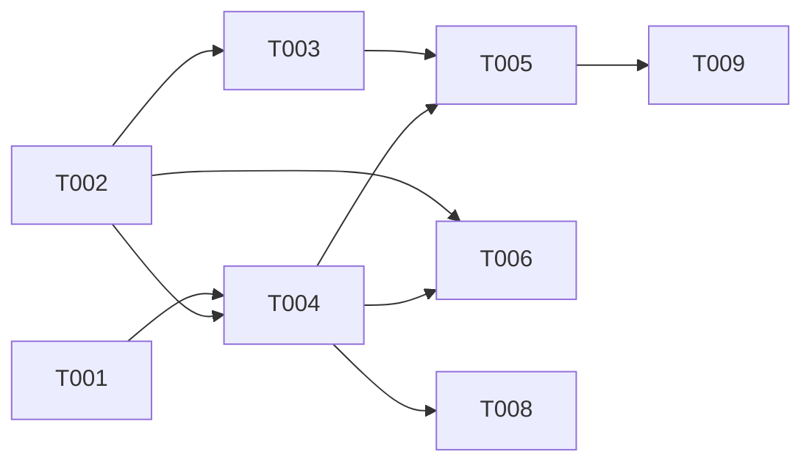

# Plan: Add MCP rpg_evolve tool for incremental updates

## Overview

- **Source**: Issue #16
- **Issue**: #16
- **Created**: 2026-02-07
- **Approach**: Minimal Change — thin MCP wrapper around existing `RPGEvolver`

## Architecture Decision

The `rpg_evolve` tool follows the established MCP tool pattern (Zod schema → execute function → server registration). No new abstractions are needed since `RPGEvolver` is already fully implemented and tested. The tool delegates directly to the existing evolution engine.

Key design points:
- **Commit-range input**: User provides a git commit range (e.g., `HEAD~1..HEAD`) and the tool runs the full evolution pipeline
- **In-memory mutation**: The tool mutates the loaded RPG in-place, matching how MCP servers maintain state
- **Optional persistence**: `outputPath` parameter allows saving the updated RPG to disk
- **Validation**: Requires loaded RPG with `rootPath` in config pointing to a valid git repo

## Tasks

- [ ] T001 [P] Add `EVOLVE_FAILED` error code and factory function (file: src/mcp/errors.ts)
- [ ] T002 [P] Define `EvolveInputSchema` Zod schema and `EvolveInput` type (file: src/mcp/tools.ts)
- [ ] T003 Add `rpg_evolve` tool definition to `RPG_TOOLS` constant (depends on T002, file: src/mcp/tools.ts)
- [ ] T004 Implement `executeEvolve` function (depends on T001, T002, file: src/mcp/tools.ts)
- [ ] T005 Register `rpg_evolve` in MCP server (depends on T003, T004, file: src/mcp/server.ts)
- [ ] T006 Export new symbols from barrel file (depends on T002, T004, file: src/mcp/index.ts)
- [ ] T007 [P] Add unit tests for EvolveInputSchema validation (file: tests/mcp.test.ts)
- [ ] T008 Add unit test for executeEvolve error paths (depends on T004, file: tests/mcp.test.ts)
- [ ] T009 Add integration test for rpg_evolve with real repo (depends on T005, file: tests/mcp-integration.test.ts)

## Dependencies



**Parallel Group 1**: T001, T002, T007 (independent)
**Sequential**: T003 → T005, T004 → T005 → T009
**Sequential**: T004 → T008, T002+T004 → T006

## Key Files

### Create/Modify
- `src/mcp/errors.ts` — Add `EVOLVE_FAILED` error code and factory
- `src/mcp/tools.ts` — Add `EvolveInputSchema`, `rpg_evolve` tool definition, `executeEvolve`
- `src/mcp/server.ts` — Register `rpg_evolve` tool, import new symbols
- `src/mcp/index.ts` — Export new symbols
- `tests/mcp.test.ts` — Unit tests for schema and error handling
- `tests/mcp-integration.test.ts` — Integration test with real repo fixture

### Reference (read-only)
- `src/encoder/evolution/evolve.ts` — `RPGEvolver` class (delegation target)
- `src/encoder/evolution/types.ts` — `EvolutionOptions`, `EvolutionResult` types
- `tests/fixtures/superjson/` — Git submodule fixture for integration tests

## Task Details

### T001: Add EVOLVE_FAILED error code

Add to `RPGErrorCode` constant:
- `EVOLVE_FAILED`: Evolution pipeline failure

Create factory function: `evolveFailedError(reason: string)`

### T002: Define EvolveInputSchema

```typescript
export const EvolveInputSchema = z.object({
  commitRange: z.string().describe('Git commit range (e.g., "HEAD~1..HEAD")'),
  driftThreshold: z.number().min(0).max(1).optional()
    .describe('Cosine distance threshold for semantic drift (default 0.3)'),
  useLLM: z.boolean().optional()
    .describe('Use LLM for semantic routing (default true)'),
  includeSource: z.boolean().optional()
    .describe('Include source code in new/modified nodes'),
  outputPath: z.string().optional()
    .describe('Save updated RPG to this path'),
})
```

### T003: Add rpg_evolve to RPG_TOOLS

Add tool definition with name, description, and inputSchema following existing pattern.

### T004: Implement executeEvolve

- Validate RPG is loaded (throw `rpgNotLoadedError`)
- Extract `rootPath` from `rpg.getConfig()`, validate it's defined (throw `invalidInputError` if missing)
- Validate `rootPath` directory exists on filesystem (throw `invalidPathError`)
- If `outputPath` provided, validate parent directory exists
- Create `RPGEvolver` with options mapped from input
- Call `evolve()` and return `EvolutionResult`
- Optionally save RPG to `outputPath` via `rpg.toJSON()`
- Wrap errors in `evolveFailedError`

### T005: Register in MCP server

Add `server.tool()` call for `rpg_evolve` following the pattern of other tools. Import `EvolveInputSchema` and `executeEvolve`.

### T006: Export from barrel

Add `EvolveInputSchema`, `executeEvolve`, and `EvolveInput` type to `src/mcp/index.ts`.

### T007-T009: Tests

- **T007**: Schema validation (valid/invalid commit ranges, optional fields)
- **T008**: Error paths (RPG not loaded, missing rootPath, evolution failure)
- **T009**: Integration test using `superjson` fixture — evolve with a known commit range and verify result stats

## Verification

### Automated Tests

- [ ] Unit tests pass: `bun run test tests/mcp.test.ts`
- [ ] Integration tests pass: `bun run test tests/mcp-integration.test.ts`
- [ ] All tests pass: `bun run test`
- [ ] Type checking: `bun run typecheck`
- [ ] Linting: `bun run lint`

### Acceptance Criteria Check

- [ ] AC-1: MCP clients can trigger incremental updates via `rpg_evolve`
- [ ] AC-2: Supports add, modify, and delete operations (via commit range diff)
- [ ] AC-3: Proper error handling and validation (RPG not loaded, invalid config, evolution failures)

## Notes

- The `rpg_evolve` tool mutates the in-memory RPG. This is intentional for MCP server sessions.
- The `RPGEvolver` requires `rootPath` from RPG config — this must point to a valid git repo with the commit range available.
- Integration tests use the `superjson` git submodule fixture which has real commit history.
- After evolution, semantic search index may become stale. Index re-sync is out of scope for this issue (can be a follow-up).

### Known Limitations

- Semantic search index is NOT automatically updated after evolution. MCP clients should restart the server or a separate index-sync tool would be needed (follow-up issue).
- `rpg_evolve` requires `rootPath` in RPG config. RPGs created without this field cannot be evolved.
