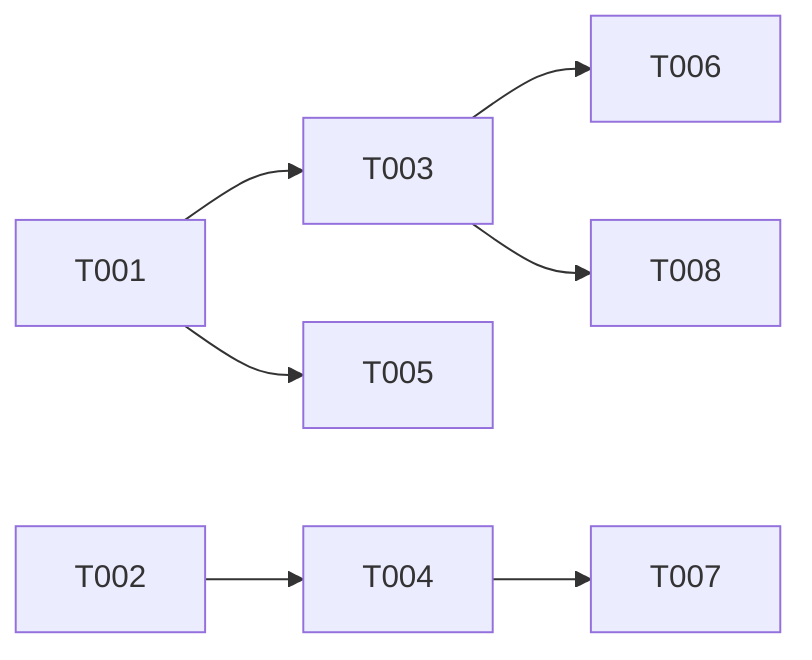

# Plan: SearchNode search_scopes & Auto Mode Staged Fallback

## Overview

- **Source**: Issue #15
- **Issue**: #15
- **Created**: 2026-02-07
- **Approach**: Pragmatic — wire up existing infrastructure, add staged fallback per paper

## Problem 1-Pager

**Context**: SearchNode is the primary intent-to-code grounding tool in RPG. The paper (RPG-Encoder §5.1, arXiv:2602.02084) defines `search_scopes` for restricting search to feature subtrees and a staged fallback policy for `auto` mode.

**Problem**: Two gaps exist between the paper spec and the implementation:
1. `searchScopes` is defined in `SearchOptions` and implemented in both GraphStore backends (SQLite recursive CTE, ContextStore BFS), but `SearchNode.searchFeatures()` never passes it through.
2. `auto` mode runs feature + snippet search as a union (both always execute). The paper defines staged fallback: feature search first, then snippet search only when feature results are insufficient.

**Goal**: Wire up `searchScopes` end-to-end and implement the paper's staged auto mode fallback.

**Non-Goals**:
- No new search strategies or scoring changes
- No changes to ExploreRPG or FetchNode
- No `searchTerms` or `lineRange` implementation (separate issue)

**Constraints**:
- Must maintain backward compatibility — existing `features`/`snippets` modes unchanged
- `auto` mode behavior changes: from union to staged fallback (breaking change for auto mode only)
- Both legacy SQLiteStore and new ContextStore paths must work

## Architecture Decision

No ADR needed — this is wiring existing infrastructure per paper spec.

**Key insight**: The store layer (`rpg.searchByFeature(query, scopes)`) already implements subtree filtering via:
- `ContextStore`: BFS traversal collecting subtree IDs, then filter search hits
- `SQLiteStore`: Recursive CTE on functional edges + FTS5 MATCH within subtree

The SearchNode tool layer simply needs to pass `searchScopes` through and implement the staged fallback logic.

## Tasks

- [ ] T001 [P] Wire searchScopes through SearchNode.searchFeatures() (file: src/tools/search.ts)
- [ ] T002 [P] Add searchScopes to MCP SearchInputSchema (file: src/mcp/tools.ts)
- [ ] T003 Implement staged auto mode fallback (depends on T001, file: src/tools/search.ts)
- [ ] T004 Pass searchScopes through executeSearch() (depends on T002, file: src/mcp/tools.ts)
- [ ] T005 Add unit tests for searchScopes filtering (depends on T001, file: tests/tools.test.ts)
- [ ] T006 Add unit tests for auto mode staged fallback (depends on T003, file: tests/tools.test.ts)
- [ ] T007 Add MCP integration test for searchScopes (depends on T004, file: tests/mcp.test.ts)
- [ ] T008 Update rpg_search MCP tool description for auto mode staged behavior (depends on T003, file: src/mcp/tools.ts)

## Dependencies



**Parallel Group 1**: T001, T002 (independent)
**Sequential from T001**: T003 → T006, T003 → T008
**Sequential from T002**: T004 → T007
**Independent after T001**: T005

## Key Files

| File | Action | Description |
|------|--------|-------------|
| `src/tools/search.ts` | Modify | Wire scopes, implement staged fallback |
| `src/mcp/tools.ts` | Modify | Add searchScopes to schema + executeSearch |
| `tests/tools.test.ts` | Modify | Add scopes + fallback tests |
| `tests/mcp.test.ts` | Modify | Add MCP-level scopes test |

## Implementation Details

### T001: Wire searchScopes through SearchNode

In `SearchNode.searchFeatures()`, pass `scopes` to `rpg.searchByFeature()`:

```typescript
// Current (line 104):
const matches = await this.rpg.searchByFeature(term)

// Updated:
const matches = await this.rpg.searchByFeature(term, scopes)
```

The method signature changes to accept scopes:
```typescript
private async searchFeatures(
  featureTerms: string[],
  strategy: SearchStrategy,
  scopes?: string[]
): Promise<Node[]>
```

For semantic search strategies (vector/hybrid/fts), scope filtering needs post-search filtering since SemanticSearch doesn't natively support scopes. Reuse the BFS subtree collection pattern from `rpg.searchByFeature()` (rpg.ts:423-439):

```typescript
if (scopes && scopes.length > 0) {
  const subtreeIds = new Set<string>()
  const queue = [...scopes]
  while (queue.length > 0) {
    const current = queue.shift()!
    if (subtreeIds.has(current)) continue
    subtreeIds.add(current)
    const children = await this.rpg.getChildren(current)
    for (const child of children) {
      if (!subtreeIds.has(child.id)) queue.push(child.id)
    }
  }
  // Filter semantic results by subtree membership
  results = results.filter(node => subtreeIds.has(node.id))
}
```

**Note**: `rpg.searchByFeature()` already handles scopes for `string` strategy. For semantic strategies, we add post-filter logic in SearchNode since `SemanticSearch.search/searchHybrid/searchFts` don't accept scope parameters.

### T003: Staged auto mode fallback

Per paper §5.1 (Appendix A.3.2):

```
1. Feature search first (SearchNode/features)
2. If results insufficient → snippet search with identifiers from step 1
3. Deduplicate and return
```

Implementation:
```typescript
if (options.mode === 'auto') {
  // Stage 1: Feature search
  const featureResults: Node[] = []
  if (options.featureTerms) {
    featureResults.push(...await this.searchFeatures(terms, strategy, scopes))
    results.push(...featureResults)
  }

  // Stage 2: Snippet fallback with identifier enrichment (paper §5.1)
  // Only triggers when feature results are insufficient
  if (results.length === 0) {
    // Use explicit filePattern if provided, or enrich with identifiers from feature results
    if (options.filePattern) {
      const snippetResults = await this.rpg.searchByPath(options.filePattern)
      results.push(...snippetResults)
    }
  }
}
```

The threshold for "insufficient" is `results.length === 0` (simple, robust — matches paper's fallback-on-failure approach). When feature search returns results, snippet search is skipped entirely to minimize wasted context (per paper: "prioritizes semantic grounding before reading large contexts").

### T002 + T004: MCP schema update

Add to `SearchInputSchema`:
```typescript
searchScopes: z.array(z.string()).optional()
  .describe('Feature node IDs to restrict search to their subtrees')
```

Pass through in `executeSearch()`:
```typescript
const result = await searchNode.query({
  ...existing,
  searchScopes: input.searchScopes,
})
```

## Verification

### Automated Tests

- [ ] Unit tests: searchScopes restricts results to subtree nodes only
- [ ] Unit tests: auto mode returns feature results when sufficient (no snippet fallback)
- [ ] Unit tests: auto mode falls back to snippet search when feature search returns empty
- [ ] Unit tests: auto mode with searchScopes + featureTerms combination
- [ ] MCP test: searchScopes parameter accepted and forwarded correctly

### Manual Testing

- [ ] Encode a real repo, search with scope restricted to a module — verify only subtree results
- [ ] Verify auto mode staged behavior with RPG MCP server

### Acceptance Criteria Check

- [ ] AC-1: Searches can be scoped to a specific subtree by node ID
- [ ] AC-2: Auto mode follows staged fallback: feature search first, then snippet + identifier
- [ ] AC-3: MCP tool schema updated with searchScopes

## Review Status

- **Reviewed**: 2026-02-07
- **Result**: APPROVED
- **User Approved**: Yes
- **Issue**: #15

## Notes

- `SemanticSearch` (vector/hybrid/fts) doesn't natively support scope filtering — post-filtering by subtree IDs is the cleanest approach
- The BFS subtree collection pattern already exists in `rpg.searchByFeature()` — consider extracting a reusable `getSubtreeIds()` helper on RPG class if the pattern is needed in multiple places
- `auto` mode behavior change is intentional per paper spec — document in MCP tool description
