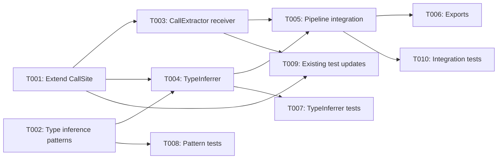

# Plan: Type-Aware Call Resolution in DependencyGraph

## Overview

- **Source**: https://github.com/pleaseai/RPG/issues/89
- **Issue**: #89
- **Created**: 2026-02-20
- **Approach**: Clean Architecture -- extend existing extractor/resolver pipeline with a new TypeInferrer stage

## Context

### Problem

`CallExtractor` resolves calls syntactically only. For `foo.bar()`, it stores `"bar"` as the callee symbol and discards the receiver `foo`. This means it cannot determine which class's `bar` method is being called when:
- The receiver is assigned via a constructor (`x = Foo()`)
- The receiver is `self`/`this` (method call on current instance)
- The receiver is a class attribute (`self.helper.save()`)
- The method is inherited from a parent class

The vendor's `dep_graph.py` (lines 590-850) implements full type-aware resolution with local variable type inference, attribute type inference, MRO traversal, and fuzzy global fallback.

### Requirements Summary

1. Preserve receiver info in `CallSite` (e.g., `self.method`, `obj.attr.method`)
2. Infer local variable types from constructor calls (`x = Foo()` -> type is `Foo`)
3. Infer attribute types from constructor/`__init__` assignments (`self.field = Bar()`)
4. Walk inheritance chain (MRO) to find method definitions
5. Fuzzy global fallback for unique method name matches (reject common names)

### Constraints

- Must use tree-sitter AST (not language-specific parsers)
- Must support all 6 languages: TypeScript, JavaScript, Python, Rust, Go, Java
- Must integrate into existing `injectDependencies()` pipeline in `dependency-injection.ts`
- Backward compatible: existing `CallSite` consumers unaffected (new fields are optional)

### Non-Goals

- Entity-level (class->class) edge creation (edges remain file-level)
- Return type inference from function signatures
- Cross-file variable type tracking
- Python C3 linearization MRO (simple depth-first is sufficient)

## Architecture Decision

**Introduce a `TypeInferrer` class as a new pipeline stage** that runs after call extraction and inheritance extraction. It enriches `CallSite` objects with resolved receiver types, enabling more accurate call edge targeting.

**Why a separate class (not extending SymbolResolver)**:
- Follows the single-responsibility pattern of `CallExtractor` and `InheritanceExtractor`
- Needs data from both call sites AND inheritance relations -- naturally sits between extraction and edge creation
- Testable in isolation with mock ASTs
- SymbolResolver continues handling file-level resolution; TypeInferrer handles class/method-level resolution

**Data flow**:
```
CallExtractor (now with receiver) -> TypeInferrer (resolves receiver type) -> SymbolResolver (file-level lookup)
```

**AST handoff**: TypeInferrer receives `sourceCode` and `language` per file and parses internally via tree-sitter, matching the pattern used by `CallExtractor` and `InheritanceExtractor`. No double-parsing overhead since TypeInferrer only parses files containing classes with receivers to resolve.

**Pipeline changes**: `injectDependencies()` goes from 4 phases to 5:
1. Import edges (unchanged)
2. Symbol table build (unchanged)
3. Call + inheritance extraction (unchanged, but CallSite now has receiver)
4. **NEW**: Type inference resolution via TypeInferrer
5. Edge creation (modified to use type-aware resolution first, fallback to existing)

## Tasks

- [ ] T001 [P] Extend CallSite interface with receiver fields (file: packages/encoder/src/dependency-graph.ts)
- [ ] T002 [P] Create type-inference-patterns module with per-language helpers (file: packages/encoder/src/type-inference-patterns.ts)
- [ ] T003 Modify CallExtractor to preserve receiver info (depends on T001, file: packages/encoder/src/call-extractor.ts)
- [ ] T004 Create TypeInferrer class with index building, MRO traversal, and variable/attribute inference (depends on T001, T002, file: packages/encoder/src/type-inferrer.ts)
- [ ] T005 Integrate TypeInferrer into dependency-injection pipeline (depends on T003, T004, file: packages/encoder/src/dependency-injection.ts)
- [ ] T006 Add exports and update package configuration (depends on T005, file: packages/encoder/src/index.ts)
- [ ] T007 [P] Add unit tests for TypeInferrer (depends on T004, file: tests/type-inferrer.test.ts)
- [ ] T008 [P] Add unit tests for type-inference-patterns (depends on T002, file: tests/type-inference-patterns.test.ts)
- [ ] T009 Update existing tests for CallSite and CallExtractor changes (depends on T001, T003, file: tests/call-extractor.test.ts)
- [ ] T010 Add integration tests for type-aware call resolution (depends on T005, file: tests/encoder/type-aware-resolution.integration.test.ts)

## Key Files

### Create

| File | Purpose |
|------|---------|
| `packages/encoder/src/type-inferrer.ts` | TypeInferrer class: indices, MRO traversal, qualified call resolution |
| `packages/encoder/src/type-inference-patterns.ts` | Per-language tree-sitter patterns for assignment/constructor detection, common method blocklist |
| `tests/type-inferrer.test.ts` | Unit tests for TypeInferrer |
| `tests/type-inference-patterns.test.ts` | Unit tests for per-language inference patterns |
| `tests/encoder/type-aware-resolution.integration.test.ts` | Integration tests for end-to-end type-aware resolution |

### Modify

| File | Changes |
|------|---------|
| `packages/encoder/src/dependency-graph.ts` | Add `receiver`, `receiverKind`, `qualifiedName` optional fields to `CallSite` |
| `packages/encoder/src/call-extractor.ts` | Modify per-language extract methods to capture receiver expression and classify as self/super/variable/none |
| `packages/encoder/src/dependency-injection.ts` | Add Phase 4 (TypeInferrer), modify `addCallEdges` to attempt type-aware resolution before fallback |
| `packages/encoder/src/index.ts` | Export `TypeInferrer` and new types |
| `tests/call-extractor.test.ts` | Add tests verifying receiver preservation across all languages |
| `tests/dependency-graph.test.ts` | Update CallSite tests to include new optional fields |

### Reuse

| File | Functions |
|------|-----------|
| `packages/encoder/src/symbol-resolver.ts` | `resolveSymbolLocation()` -- existing 4-strategy fallback for unresolved calls |
| `packages/encoder/src/inheritance-extractor.ts` | `extract()` -- provides `InheritanceRelation[]` for TypeInferrer's inheritance index |
| `packages/utils/src/ast/parser.ts` | `ASTParser.parse()` -- tree-sitter parsing infrastructure |
| `packages/utils/src/ast/languages/*.ts` | Per-language grammar configurations |

## Verification

### Automated Tests

- [ ] TypeInferrer unit tests: index building from entities and inheritances
- [ ] TypeInferrer unit tests: MRO traversal with cycle detection
- [ ] TypeInferrer unit tests: `inferLocalVarType()` for `x = Foo()` patterns
- [ ] TypeInferrer unit tests: `inferAttributeType()` for `self.field = Bar()` patterns
- [ ] TypeInferrer unit tests: global fuzzy fallback with common name rejection
- [ ] CallExtractor tests: receiver preservation for all 6 languages
- [ ] Type-inference-patterns tests: per-language constructor/attribute assignment detection
- [ ] Integration test: `self.method()` resolves through inheritance chain
- [ ] Integration test: `var = Foo(); var.method()` resolves through type inference
- [ ] Integration test: `super().method()` resolves to parent class
- [ ] Integration test: common method names (`get`, `set`) rejected by fuzzy fallback

### Manual Testing

- [ ] Run `rpg encode` on a real multi-file project and verify improved call edge connectivity
- [ ] Compare call edge count before/after on the `tests/fixtures/superjson` submodule

### Acceptance Criteria Check

- [ ] All 6 languages supported in receiver extraction
- [ ] No regression in existing import/call/inherit edge creation
- [ ] Full test suite passes (`bun run test`)
- [ ] Linter passes (`bun run lint`)

## Dependencies



## Review Status

- **Reviewed**: 2026-02-20
- **Result**: APPROVED
- **User Approved**: Yes
- **Issue**: #89
- **Notes**: Addressed reviewer feedback -- merged T004/T005, added unit test tasks (T007-T009), fixed integration test path convention

## Notes

- The vendor's `_infer_local_var_type()` does NOT handle return type annotations (`def foo() -> SomeClass`). We match this scope intentionally -- return type inference is a future enhancement.
- MRO traversal uses simple depth-first (not Python C3 linearization). This matches the vendor's approach and covers the vast majority of real-world inheritance chains.
- `DependencyGraph` class remains a passive data container. TypeInferrer builds its own optimized indices from the same data for O(1) lookups.
- The `toDependencyEdges()` method on `DependencyGraph` remains unused (was already dead code before this change).
